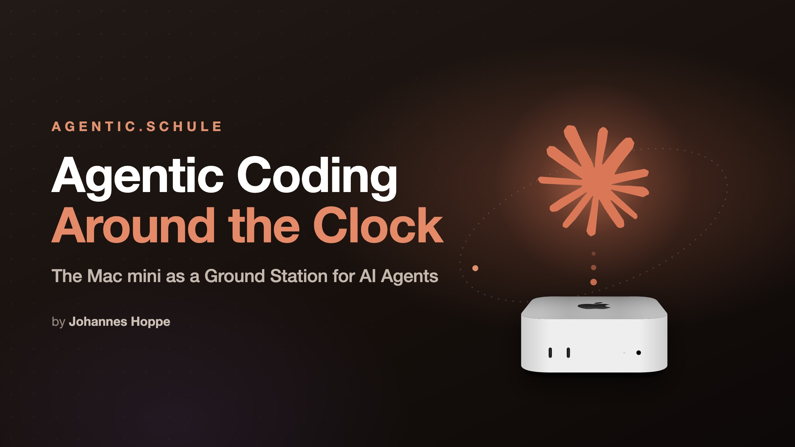

Sound familiar? You send your agent off to do some web research, and it gets locked out.

**When a site deliberately locks you out, that is its good right. But most of the time the operator only wants to keep out the big bot farms, the ones whose traffic causes real trouble. Your agent, with its handful of requests, causes none of that trouble, yet it lands in the same filter and gets swept up with them. The reason lies with the agent's browser: to any simple bot check, a default Playwright launch looks like a suspicious machine. The fix is your own, dedicated Playwright MCP that behaves as normally as a human's browser.**

This article shows how a default headless browser gives itself away (with concrete values), how to set up your own MCP so updates cannot break it, and where the limit of this whole exercise lies.

## Contents

[[toc]]

## Why Playwright?

Playwright is one of the most popular ways to automate a Chrome, if not the most popular. Developers have relied on it for years. It drives a real browser remotely: run JavaScript, take screenshots, fill in forms, all of it works beautifully.

So it makes sense to hand your own AI agent a Playwright via MCP (Model Context Protocol) as well. That way it does not have to laboriously install the tool itself, which it would only do on command anyway. At least I hope so, that no research agent just goes off installing things on its own. 😅

A task then sounds something like this: "Research topic X. If you get locked out, do not give up and use your installed Playwright MCP." The main model passes the instruction down to its sub-agents, and they reach for Playwright at their own discretion, as a matter of course.

In principle this works wonderfully. If only it weren't for the blocks.

## The problem: knocked politely, still locked out

The starting point is harmless. An agent reads a few documentation pages to verify some claims, calmly and without haste. No scraping, no load, nothing a human with the same intent wouldn't also do. And yet nothing usable comes back:

- Instead of content you get "Access Denied" or "Checking your browser…".
- The page loads but stays empty because the frontend bails out.
- The landing page comes through, every subpage refuses.

What can happen next is worse than the failure itself. Sometimes the sub-agent you tasked simply gives up and reports that it could not get through. But it can also dodge instead of giving up: it grabs the search-engine preview as a stopgap, the cache, a quote from someone else's blog, or it hallucinates the whole thing. In the result this reads just as confidently as a real source. That is the insidious part: a blocked source quietly turns into a worse source. That is why I check every claim against the primary source once more at the end. An excerpt or a preview does not count as evidence for me, only the page I actually opened.

And the wind is getting rougher. Cloudflare sits in front of a large part of the web and [is announcing new defaults as of 15 September 2026](https://blog.cloudflare.com/content-independence-day-ai-options/):

> For all new domains onboarding to Cloudflare, the categories of Training and Agent will be blocked by default on the pages that display ads, while Search will remain allowed by default.

The very category "Agent" is telling: real-time access by AI agents now counts as its own class of traffic, blocked by default for new, ad-funded sites. That is a site's deliberate decision, and I respect it, more on that below. The trouble this article is about is a different one: the crude filters that sort out every kind of automation and hit the friendly reader along with everyone else.

## Why this happens: the browser looks suspicious

A freshly started Playwright browser carries, among other things, three traits that no normal browser has. I read the following values off my own machine, once in the default state and once with the configuration we are about to build:

| Trait | Playwright in its default state | with your own configuration |
|---|---|---|
| `navigator.userAgent` | `…HeadlessChrome/…` | `…Chrome/…` |
| `navigator.webdriver` | `true` | `undefined` |
| `navigator.languages` | `["en-US","en"]` | `["de-DE","de","en-US","en"]` |

These default values are a problem. The word **HeadlessChrome** sits in the user agent and goes to the server with every single request. Detecting it takes no sophisticated analysis, a simple text match is enough: no normal user browses headless. **`navigator.webdriver`** is a standardised flag that the browser sets itself when it is remote-controlled, and a bit of JS reads it out in no time. And the language list `["en-US","en"]`? On its own it is no proof, because plenty of people really do have English set as their only language. It only becomes a signal in combination. A typical heuristic compares the browser language against the geolocation of the IP: a visit from Germany that reports US English only does not fit together well. On top of that, the default list is the same on every Playwright installation. So on its own the language list stays weak. Together with the other traits it becomes one more building block in the overall picture.

The crucial point: **these traits say nothing about intent.** But they make it very easy to spot automation. When an operator filters crudely, it locks out the friendly reader just as much as the mass scraper.

## The fix: your own, dedicated Playwright MCP

Claude Code can talk to Playwright through an [MCP server](https://code.claude.com/docs/en/mcp), and there is an official plugin from Microsoft for it in the marketplace. It starts the open-source server [`@playwright/mcp`](https://github.com/microsoft/playwright-mcp) and installs with a single command:

```bash
claude plugin install playwright@claude-plugins-official
```

That is what I started with, and it is surely how many will approach it: a plugin from the official marketplace, from a vendor you trust, where you know what you are getting. In the end I still switched it off and registered the server myself. There are two reasons for that.

**First, durability.** Tweaking the ready-made plugin directly is the obvious move, there is not much in it anyway, the whole definition is four lines:

```json
{ "playwright": { "command": "npx", "args": ["@playwright/mcp@latest"] } }
```

So just add the arguments and you are done? That is a trap: the file lives in the plugin cache, and Claude Code rewrites that cache on every update. Any change there is gone again after the next update. A server you register yourself lives elsewhere: according to the [MCP documentation](https://code.claude.com/docs/en/mcp-quickstart), with `--scope user` it ends up in `~/.claude.json` under the key `mcpServers` and then applies to all projects. Updates do not touch that file.

Conveniently, your own server wins anyway: the documentation gives the order as Local, Project, User, and only then Plugins, and makes clear that exactly one entry always wins ("The entire server entry from that source is used; fields are not merged across scopes"). So your own `playwright` trumps the plugin. I still switch the plugin off, because two definitions for the same thing are an invitation to guesswork.

**Second, clarity.** I prefer having all settings in one configuration file rather than spread across a growing chain of command-line switches. And here it is not just taste: additional Chrome arguments (more on that shortly) can **only** be set through the configuration, there is no matching CLI flag. One file, one truth.

> **🛠️ Build it yourself: register the server**
> ```bash
> claude mcp add playwright --scope user -- \
>   npx @playwright/mcp@latest --config ~/.config/playwright-mcp/config.json
> ```
> Everything after the `--` is the server's start command. You switch the bundled plugin off in `~/.claude/settings.json`:
> ```json
> { "enabledPlugins": { "playwright@claude-plugins-official": false } }
> ```
> Or you just install the official plugin again. Works just as well.
> After that, `claude mcp list` shows your own server, ideally with `✔ Connected`.

## Unobtrusive is not invisible

Now let's disguise the Chrome a little. Two moves are enough to get rid of the three giveaways.

The user agent is set to a normal Chrome string. The version number is what matters here: it should match the Chrome that is actually installed. A user agent claiming version 130 while the browser behaves like version 150 in every other detail looks suspicious. That is why my setup script reads the version out of the installed Chrome instead of hard-coding it.

The rest is a small script that runs before every page load:

> **🛠️ Build it yourself: `pw-stealth.js`**
> ```js
> // Remove the automation flag
> Object.defineProperty(navigator, 'webdriver', { get: () => undefined });
>
> // A realistic language list instead of just en-US
> Object.defineProperty(navigator, 'languages', {
>   get: () => ['de-DE', 'de', 'en-US', 'en']
> });
> ```
> The user agent deliberately cannot be set here, because it sits in the request header and goes out before any JavaScript even runs. The configuration takes care of that.

**But the disguise has a limit:** it does nothing against serious bot management. Systems like Cloudflare Turnstile or DataDome look at the TLS fingerprint, measure mouse movements and timings, and pose active computational challenges. Two lines of JavaScript do not impress them, and that is a good thing. Anyone facing a barrier like that has been given a clear answer: this site does not want to be read by automation. That is where it ends, regardless of what would be technically possible.

There is a second point that costs nothing and decides everything: **stay fair.** Respect `robots.txt` and terms of service. Read a few pages calmly instead of hammering away. Do not bypass access walls or paywalls. My standard is that my own browser behaves like a human with the same intent, and not one bit beyond that.

## Headless on a machine without a screen

My agent machine is a [Mac mini without a monitor](https://agentic.schule/blog/2026-07-agentic-coding-mac-mini) that nobody logs into graphically. On exactly that machine the real Chrome crashed reproducibly at startup whenever no graphical login was active, with `CVDisplayLink failed` and a SIGTRAP. The reason is unspectacular: at startup Chrome builds a graphics and display context, and without an active graphical session there is none. The fix is the following Chrome argument:

```json
"args": ["--disable-gpu"]
```

Without a GPU process the display context is never touched, and the crash becomes structurally impossible. WebGL still works, because Chrome then renders in software (SwiftShader). That costs a small remainder of inconspicuousness, because the WebGL renderer is now called "SwiftShader" instead of a real graphics card. I happily pay that small price: a reliably running browser matters more to me than a flawless graphics fingerprint.

And here you see why the configuration file is necessary: there is no command-line switch for additional Chrome arguments, `launchOptions.args` exists only in the configuration.

## Housekeeping: where do the files go?

An inconspicuous detail with consequences. The Playwright MCP leaves traces on disk: snapshots of the page structure, screenshots, console logs. By default they land in a folder `.playwright-mcp` **in the current working directory**, and for a coding agent that is, of course, the repository. Here is how the source of `@playwright/mcp` handles this (version 0.0.78):

```js
function outputDir(options) {
  if (options.config.outputDir)
    return path.resolve(options.config.outputDir);
  const baseName = options.config.skillMode ? ".playwright-cli" : ".playwright-mcp";
  if (isSystemDirectory(options.cwd) || !isWritable(options.cwd))
    return path.join(os.tmpdir(), baseName);
  return path.join(options.cwd, baseName);
}
```

So without `outputDir` the server writes right into the project you are currently working on. You then have to delete the artifacts by hand and, if needed, add a `.gitignore` so they don't end up in the next commit. And without cleanup the folder just keeps growing.

The second part of the problem is the cleanup function. It exists, but by default it does nothing:

```js
async _enforceOutputBudget() {
  const maxSize = this._context.config.outputMaxSize;
  if (!maxSize)
    return;
  // … delete the oldest files until the budget fits again
}
```

The first condition explains it completely. With no budget set, the function returns immediately and never deletes anything. With a budget set, it sorts by modification date and removes the oldest files first. So we should absolutely set a budget!

> **🛠️ Build it yourself: the full configuration**
> `~/.config/playwright-mcp/config.json`
> ```json
> {
>   "outputDir": "/tmp/playwright-mcp",
>   "outputMaxSize": 209715200,
>   "browser": {
>     "browserName": "chromium",
>     "isolated": true,
>     "launchOptions": {
>       "channel": "chrome",
>       "headless": true,
>       "args": ["--disable-gpu"]
>     },
>     "contextOptions": {
>       "userAgent": "Mozilla/5.0 (Macintosh; Intel Mac OS X 10_15_7) AppleWebKit/537.36 (KHTML, like Gecko) Chrome/<version>.0.0.0 Safari/537.36"
>     },
>     "initScript": ["/path/to/pw-stealth.js"]
>   }
> }
> ```
> `outputDir` routes the files centrally to `/tmp`, `outputMaxSize` (200 MB here) is what turns the cleanup on in the first place. `channel: chrome` uses the installed Chrome instead of a test browser, `isolated: true` gives each session a fresh profile in memory, which avoids lock conflicts with parallel sessions. The setup script below fills in the version number in the `userAgent` (`<version>`) to match the machine.

> **⚠️ Keep in mind when debugging:** the configuration is read when the server starts. If you change it and wonder why nothing happens, you are debugging against the wrong process. The fix is to reconnect the server, which reads the configuration fresh.

## Setup: one script per machine

And I like to automate everything: here is my command that sets up a fresh machine with the Playwright MCP for Claude Code and keeps the configuration identical across several machines.

> **🛠️ Build it yourself: `setup-playwright-mcp.sh` (core)**
> ```bash
> #!/usr/bin/env bash
> set -euo pipefail
>
> # Derive the user agent from the real Chrome so the version matches the
> # installed browser (otherwise the discrepancy gives everything away).
> CHROME="/Applications/Google Chrome.app/Contents/MacOS/Google Chrome"
> VER="$("$CHROME" --version | grep -oE '[0-9]+' | head -1)"
> UA="Mozilla/5.0 (Macintosh; Intel Mac OS X 10_15_7) AppleWebKit/537.36 (KHTML, like Gecko) Chrome/${VER}.0.0.0 Safari/537.36"
>
> CONFIG="$HOME/.config/playwright-mcp/config.json"
> mkdir -p "$(dirname "$CONFIG")"
> cat > "$CONFIG" <<JSON
> { "outputDir": "/tmp/playwright-mcp", "outputMaxSize": 209715200,
>   "browser": { "browserName": "chromium", "isolated": true,
>     "launchOptions": { "channel": "chrome", "headless": true, "args": ["--disable-gpu"] },
>     "contextOptions": { "userAgent": "$UA" },
>     "initScript": ["$HOME/bin/pw-stealth.js"] } }
> JSON
>
> # idempotent: remove first, then register cleanly again
> claude mcp remove playwright --scope user >/dev/null 2>&1 || true
> claude mcp add playwright --scope user -- npx @playwright/mcp@latest --config "$CONFIG"
> ```

## Cleaning up: leftover Chrome processes

On my machine, unused Chrome processes piled up and increasingly tied up memory. This is a known problem: leftover Chrome processes [after the session closes](https://github.com/microsoft/playwright-mcp/issues/1568), [whole orphaned process trees](https://github.com/microsoft/playwright-mcp/issues/1634), and [zombies stuck in the app switcher](https://github.com/microsoft/playwright-mcp/issues/1458). The issues are closed, yet the pattern keeps showing up for me.

I got by with simply killing the processes once they reach a certain age. A call that is currently running has a young browser and is spared, yesterday's corpses get thrown out.

> **🛠️ Build it yourself: `chrome-reaper.sh`**
> ```bash
> #!/usr/bin/env bash
> # Kills Google Chrome processes older than CHROME_MAX_AGE_MIN minutes.
> # A call that is currently running has a young browser and is spared.
> # DRY_RUN=1 only shows what would be killed.
> set -uo pipefail
> export PATH=/usr/local/bin:/opt/homebrew/bin:/usr/bin:/bin
>
> MAX_AGE_MIN="${CHROME_MAX_AGE_MIN:-120}"
> DRY_RUN="${DRY_RUN:-0}"
> threshold=$(( MAX_AGE_MIN * 60 ))
>
> # convert etime ([[DD-]HH:]MM:SS) to seconds
> etime_to_secs() {
>   awk -F'[-:]' '{
>     if (NF==4) print (($1*24+$2)*60+$3)*60+$4;
>     else if (NF==3) print ($1*60+$2)*60+$3;
>     else if (NF==2) print $1*60+$2;
>     else print 0
>   }' <<<"$1"
> }
>
> # bracket trick: this way grep doesn't match itself
> while read -r pid etime _; do
>   [ -z "${pid:-}" ] && continue
>   [ "$(etime_to_secs "$etime")" -gt "$threshold" ] || continue
>   [ "$DRY_RUN" = "1" ] && { echo "[dry-run] would kill: $pid ($etime)"; continue; }
>   kill -9 "$pid" 2>/dev/null
> done < <(ps -Ao pid=,etime=,command= | grep '[G]oogle Chrome')
> ```
> On a schedule it runs via `launchd` every 15 minutes on my machine; a cron entry `*/15 * * * *` does the same. Check safely up front with `DRY_RUN=1` what would be killed.

This only cleans up, it does not fix the cause. The solution is a bit brutal, but for me the problem is solved. For a machine that researches around the clock, I prefer that to memory filling up.

## Conclusion

In principle, all we did was wire up the official `@playwright/mcp` a little better. But the gain is noticeable.

Research becomes **more reliable**, because the agent actually gets to see public pages instead of falling back on second-hand excerpts. It becomes **more verifiable**, because a page read in full is citable. And the repositories stay **clean**, because the artifacts are stored centrally and cleaned up automatically.

What holds here too:

- **This is not an invisibility cloak.** It does nothing against serious bot management, and it is not meant to. A hard block is a clear answer.
- **It stays hands-on work.** The user agent is tied to the installed Chrome version and goes stale with every update. That is why the script generates it instead of hard-coding it.
- **Fairness should stay!** `robots.txt`, terms of service, and a calm request rate are the condition for this way of working being OK with me.

In the end it comes down to a small repair with a big effect: the agent no longer lands in the crude filter that never meant it.

By the way, this research browser runs on my end permanently on a machine that never shuts off. How that ground station is built is described in the companion article ["Agentic coding around the clock: the Mac mini as a ground station"](https://agentic.schule/blog/2026-07-agentic-coding-mac-mini).

<a href="https://agentic.schule/blog/2026-07-agentic-coding-mac-mini"></a>

**Questions, feedback, your own experiences with locked-out agents?** Bring them on, I am glad to hear from you.

---

*Curious about agentic work in practice? In the workshops at [agentic.schule](https://agentic.schule) and [angular.schule](https://angular.schule) we show how modern AI agents are changing everyday development.*
