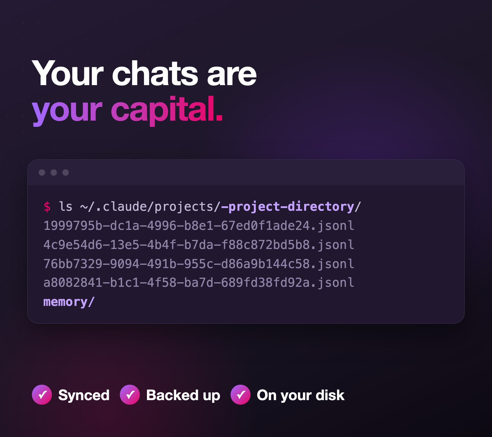
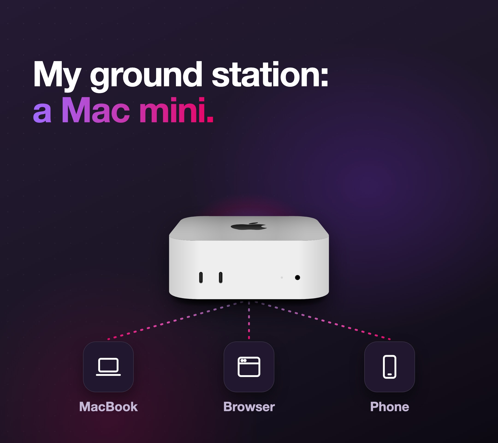
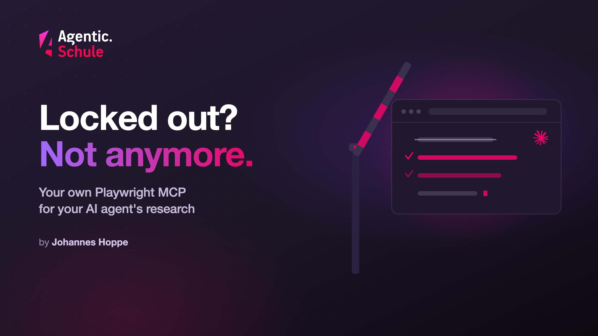

ChatGPT now has dots, Claude has cloud sessions: AI agents that run in the cloud while you don't have to worry about a thing. Convenient, no question. And yet I don't like these offerings.

**The conversations with your agent are your capital, and they belong on your own disk, not in someone else's cloud. My answer is a Mac mini as an always-running "ground station": a machine that belongs to you, a dedicated sandbox, reachable from anywhere. Your agents keep working while you watch and step in from the MacBook, the browser, or even your phone.**

The box was initially sitting on the shelf for a completely different reason: a current Mac mini M4 with 32 GB that I had actually bought to join the **Clawdbot** hype (today *[OpenClaw](https://openclaw.ai)*), controlling your own agent from your phone via **[Signal](https://signal.org)**, that had something to it. It was cool exactly as long as that remote control was the main appeal. Since [Claude Code](https://claude.com/claude-code) can do the same out of the box with **`/remote-control`**, the Clawdbot has lost much of its charm for me, and the mini was getting a bit bored anyway (maybe more on that another time). So it got a new, permanent job.

This article shows the idea, the building blocks, and, in how-to boxes, how to build it yourself.

> 🛰️ The nickname for the setup was found quickly: *Ground Control to Major Tom*. The Mac mini is the ground station, the MacBook the mobile rocket that docks and lifts off again.

## Contents

[[toc]]

## The Problem: Agents Want to Run, I Want to Leave

_Agentic coding_ works differently from a chat window: you set the direction, and the agent reads code, writes files, runs tests, and plans the next steps on its own. Such runs take time: minutes, sometimes hours. And that's exactly where things clash with a laptop that you fold shut, carry into a café, or send to sleep on the train.

On the laptop, this is what happens:

- I fold it shut → the process goes to sleep, the agent freezes mid-run.
- In the evening I just want to *quickly* check from the couch how far it's gotten, and would have to boot the laptop back up.

The first problem can be worked around with `caffeinate -s`: the laptop simply stays on with the lid closed, as long as it stays plugged in. That's exactly how I worked in winter and spring. But at summer temperatures the thing quickly gets far too hot, and I'd like to keep it for a good while longer. A laptop running hot for months is not a good permanent solution.

On top of that, there's a pattern I notice in myself: my best ideas rarely come at the desk, but on the go, while walking the dog, for example. That's exactly when I want to quickly toss the agent something or check on its progress, without first heading home to the laptop.

The solution is conceptually simple: **The agent doesn't run on the device near me, but on a dedicated machine that never goes off and is always on.** The device in my hand is just a window onto it.

## Why Not Just the Cloud?

At this point the obvious objection is: there are ready-made cloud offerings for exactly this. Your agent runs on someone else's infrastructure, always on, and you administer nothing. In principle a great thing. Only: these offerings don't appeal to me, and that has solid reasons. The figures and quotes below are as of October 2026.

**ChatGPT dots** (OpenAI writes them lowercase). Each dot is, per OpenAI, "frontier intelligence", "Powered by GPT‑6 Astra", and has "their own cloud computer". They're rolling out "today in ChatGPT to Pro and Business Premium users in eligible markets"; Enterprise users get a beta once their workspace admin enables it. So a dot requires a paid plan: "Your first dot is included in your Pro or Business Premium plan at no extra cost." The first one is included, and "in the future, you'll be able to add more dots, and scale the output of each dot", so more agents and more output cost on top. The decisive part for me: the agent and its data sit on OpenAI's machines, not mine.

**Claude Code cloud sessions.** These run in a VM managed by Anthropic with, per the docs, "approximate resource ceilings": "4 vCPUs" and "16 GB of RAM". That's puny. And the docs themselves say what to do then: "The VM may stop tasks that need significantly more memory … For workloads beyond these limits, use Remote Control to run Claude Code on your own hardware." So if you seriously need resources, the docs send you to your own hardware anyway. To be fair: "There is no separate compute charge for the cloud VM", and the cloud sessions share the usage limit with the rest of your Claude usage. Cloning code requires GitHub. And yes, you can pull a cloud session into your own terminal via teleport (Anthropic's feature for moving a running cloud session to a local terminal), but it started off in the cloud first.

Commercially you get the same as a rented dev environment ([GitHub Codespaces](https://github.com/features/codespaces), [Coder](https://coder.com), [Google Cloud Workstations](https://cloud.google.com/workstations)) or a hosted agent service ([Devin](https://devin.ai), [Google Jules](https://jules.google)), billed continuously per compute-hour or seat.

Soberly speaking, there's also a solid business interest behind this. The monthly subscriptions can hardly be raised further without customers hating every price increase. An additional cloud service, billed per usage or per seat, is from the provider's point of view an elegant new revenue stream. That's my reading, but it explains the push into the cloud rather well.

As different as these offerings are, they share the one catch that bothers me most: your conversations with the agent then live somewhere in someone else's cloud. And those are too valuable to me for that.

## Your Chats Are Your Capital

The question that occupies me most: where do the chats live? The knowledge I've built up with the agent, the decisions, the reasoning, the dead ends, that's my capital. I want to sync it across several machines, I want to be able to back it up, and I want to still look up in a year what I discussed back then. None of that works well when it lives in someone else's cloud.

Claude Code stores its conversation logs locally under `~/.claude/projects/`, one `.jsonl` file per session. In the same project folder there's also the subfolder `memory/`, where the agent keeps persistent notes. Exactly this trove is what I want to preserve, on my own, encrypted disk.

<figure style="margin: 1.5em auto; max-width: 600px;">
  
  <figcaption style="text-align: center; color: #8f84a6; font-size: 0.9em; margin-top: 0.6em;">A look inside a project folder: one <code>.jsonl</code> per session, plus <code>memory/</code>. Synced, backed up, on my disk.</figcaption>
</figure>

> **⚠️ Definitely adjust `cleanupPeriodDays`.** By default Claude Code clears the conversation logs under `~/.claude/projects/` after 30 days. If you want to keep them as a reference, set `cleanupPeriodDays` in `~/.claude/settings.json` much higher, in my case to 365. Otherwise a tidied-up machine deletes the history.

On the ground station these files live on my disk and get mirrored to my MacBook (how exactly, I show in the [Everything Duplicated](#everything-duplicated-always-in-sync) section). That lets me continue a session I started on the mini over on the MacBook: context, history, everything there.

That's why, for me, any pure cloud offering is a showstopper. This stance runs through my whole setup; with the [auto account switch](https://agentic.schule/en/blog/2026-09-agentic-coding-auto-account-switch), too, it was exactly about keeping control over my own data.

## The Architecture: Ground Station and Mobile Mirror

<figure style="margin: 1.5em auto; max-width: 760px;">
  
  <figcaption style="text-align: center; color: #8f84a6; font-size: 0.9em; margin-top: 0.6em;">The ground station sits on the network, everything else docks in: MacBook, browser, phone.</figcaption>
</figure>

Two machines, one common denominator:

| | **Ground station** | **mobile mirror** |
|---|---|---|
| Device | Mac mini (Apple Silicon), always-on | MacBook Pro 16″ (Apple Silicon) |
| Role | main machine, the agents run here | rocket, docks from anywhere |
| User | same account, same home | same account, same home |

The crucial trick: **Both machines use the same username and therefore the same home directory `/Users/<name>`.** All paths, all repos, all keys and, as we'll see shortly, all agent sessions live under identical paths on both machines. That makes the transition smooth: what applies on the mini applies one-to-one on the MacBook Pro.

Strictly speaking, a third role joins in: **devices that only work as a terminal**, no dev environment of their own, no copy of the data, just a window into the ground station. That's the phone (via Termux, an Android terminal app) on the one hand, and on the other a small MacBook that I only bring along as a terminal; I simply call it **"Mac Terminal"**. So the only full mirror is the big MacBook Pro: it can do both, work standalone *or* just serve as a window. Everything else is a pure terminal.

The mini sits without a monitor and without a keyboard among the rest of my home tech, next to the NAS, the router, the fat switch, and all the cabling you tend to have hanging on your network. It's reachable only over the network. That sounds like a limitation, but it's half the trick: what runs *headless* (without a screen and without visible windows) also runs when nobody is logged in.

Why a Mac mini of all things? For this role it's almost perfect: Apple Silicon delivers a lot of performance for the money, the box is **tiny** and fits in any corner, runs **absolutely silently** (I never hear the fan in everyday use), and sips so little **power** that running it 24/7 barely shows up on the bill. At idle it draws just a handful of watts. Exactly what you want from a machine that never turns off.

## A Dedicated Sandbox

Besides the chats, this is the second reason for a machine of my own. The mini isn't my everyday laptop, where I do all sorts of things, but a machine with exactly one job: coding. On the ground station, only what's needed for the work runs. I'm not logged in anywhere else there, not even my usual password manager is installed.

That makes the whole Mac mini essentially a **sandbox**: whatever an agent could mess up there stays tightly contained. For agents that increasingly run commands on their own, that's a reassuring thought, and it costs me nothing extra, because the machine only has this one job anyway.

## Surviving Connection Drops

Moving to a remote machine does, however, introduce a problem that never existed locally: the connection to it can drop. A Wi-Fi switch (office → train → home) is enough, and a normal SSH terminal is dead. The answer to that is **[tmux](https://github.com/tmux/tmux)**, a terminal multiplexer. Instead of starting my programs directly in the SSH session, they run *inside* tmux on the mini. If the connection drops, tmux, and everything in it, simply keeps running. On the next dock-in I reattach as if nothing had happened. **tmux is the central building block** of this setup, only through it do the agent runs survive everything that can go wrong between me and the mini.

Two things make it comfortable:

- **Auto-attach on login:** every interactive login lands automatically in the same session (`main`). I don't have to start anything by hand.
- **`tmux-continuum`** saves the layout every 15 minutes and restores it after a reboot.

Important to understand: tmux saves the **connection**, not the power. A reboot still ends the running processes, but the layout and the windows come back, and the agent session can be resumed (more on that shortly).

> **🛠️ Build it yourself: auto-attach in `~/.zshrc`**
> ```bash
> # On interactive login, automatically attach to the tmux session 'main'
> if [[ -z "$TMUX" && -n "$SSH_CONNECTION" ]]; then
>   tmux attach -t main 2>/dev/null || tmux new -s main
> fi
> ```
> The most important reflex afterwards: detach with **`Ctrl-b d`** (it keeps running!), **never leave with `exit`**, that kills the window.

## Docking In From Anywhere: All the Way to the Phone

For access I rely entirely on **[mosh](https://mosh.org)** (Mobile Shell), at home as on the road, always the same command. That way I never have to think about or switch between `ssh` and `mosh`.

And mosh is great. It's the better SSH for everything that isn't on a fixed cable: if the network changes or briefly drops, the connection lives on **roaming-proof**, no frozen terminal, no "broken pipe". Typed characters appear instantly via local echo, even with lousy latency on the train. Network gone, network back, mosh just keeps going without reconnecting. Underneath it's a completely normal SSH login with key auth, no password.

mosh does have one catch: it needs open UDP ports (between 60000 and 61000) and only transfers the visible screen, so the scrollback stays patchy. In my setup, tmux keeps the history anyway.

And how does the phone even reach the box back home from the road? I started with the Fritzbox's **[WireGuard](https://www.wireguard.com)** VPN; these days everything runs over **[Tailscale](https://tailscale.com)** (a mesh VPN based on WireGuard). The reason: Tailscale also copes wonderfully with **IPv6** and constantly changing connections, you reach the ground station reliably, no matter which network you're on. You always get home.

And the pièce de résistance: **From the phone.** On Android the terminal app *[Termux](https://termux.dev)* runs, inside it mosh, inside that tmux, inside that the agent. That way I can reach the raw session from anywhere if need be.

I rarely use that direct terminal route, though. Most of the time I work more comfortably on the phone via the **Remote Control feature of the Claude app**. Getting in involves a little ritual: open a new tmux window (`Ctrl-b c`), start `claude`, release remote control with `/rc`, and name the session with `/rename`. *Only then* do I switch to the app and keep typing there. Fiddly the first time, but you get used to it.

> **🛠️ Build it yourself: one short name, always mosh**
> Set up an alias in `~/.ssh/config` (mosh uses it just like ssh):
> ```ssh-config
> Host mini
>   HostName mini    # LAN name or the mini's Tailscale name
>   User youruser
> ```
> Then the same command works from anywhere:
> ```bash
> mosh mini
> ```
> From outside, a mesh VPN like **Tailscale** makes sure `mini` is always reachable, over IPv6 too.

> **📱 Phone trick (Termux):** Termux has no Ctrl key. It lives on **Volume-Down**, so `Vol-Down + C` for `Ctrl-C`, `Vol-Down + R` for `Ctrl-R`. The extra key row (ESC/CTRL/TAB/arrows) appears with a swipe up. Thank me later! 😄

## Everything Duplicated: Always in Sync

Up to here I could *access* the mini from anywhere. But the clever part is that my big MacBook Pro is a **full mirror**: it has the same files and can take over the mini's work at any time, offline, too. Why does that matter to me? In a full power outage I don't want to be caught with my pants down, the big Mac and the mini are always in sync. As a nice side effect, this mirror feels like a permanent, second-by-second backup. Damn, that's good, with one important caveat I'll get to below.

This is handled by **[Syncthing](https://syncthing.net)**, a peer-to-peer sync with no cloud in between. It mirrors bidirectionally:

- `~/Work`: all projects and repos
- `~/.claude`: the agent sessions and the `memory/` directory from the [Your Chats Are Your Capital](#your-chats-are-your-capital) section. Only the sync makes them available on both machines.
- `~/Shots`: screenshots (handy, more on that in a moment)

What gets synced is **source code, not artifacts.** `node_modules`, `dist`, `build`, `target`, and caches are in `.stignore` and get rebuilt per machine (`npm ci`, `cargo build`). Copying compiled binaries across machines breaks at library linking sooner or later anyway, better to rebuild cleanly.

> **🛠️ Build it yourself: exclude artifacts from the sync (`.stignore`)**
> ```gitignore
> node_modules
> dist
> build
> target
> .angular
> .next
> // add caches as needed
> ```
> Rule of thumb: whatever an `npm ci` or `cargo build` restores in seconds doesn't belong in the sync.

**The screenshot trick as a bonus:** because both Macs have the same home, a screenshot lives under the same path on *both* machines. I set the macOS screenshot folder to `~/Shots` (`defaults write com.apple.screencapture location ~/Shots && killall SystemUIServer`), take a screenshot on the MacBook, and drag it into an agent session running **remotely** on the mini. The path exists there too thanks to sync, the agent reads the image even though it was created "on the other machine".

> **⚠️ The one discipline:** "wait for green" before switching machines. If you switch machines while Syncthing is still transferring, you risk conflict files. Just check that the sync is `idle`, then the transition is clean.

> **⚠️ And the promised caveat: a mirror is not a backup.** A bidirectional sync also replicates deletions and broken files faithfully. The newer version wins, an empty one if need be. The safeguard against that is Syncthing's **file versioning** (`.stversions`): before every overwrite it stores the old state with a timestamp. And because that history is **local per device** and is not synced along, in a pinch one machine still has what the other has already lost. That does not replace a real off-device backup, but it brings back a chat history you'd otherwise give up on.

## Running Services Headless

An agent is only as good as the environment it's allowed to work in. On the mini it should find a **complete dev stack**: database, [Docker](https://www.docker.com), browser. And that without anyone logging in at a screen. Because the mini has no logged-in desktop at all.

Three building blocks:

**FileVault with remote unlock.** The disk is encrypted, as it should be. But after a restart the mini hangs at the pre-boot lock. Only once the FileVault password is entered does it boot through and the services start. At that point there's no network yet, so an SSH login doesn't help. My solution is a **[JetKVM](https://jetkvm.com)**, a small KVM-over-IP device (keyboard, video, and mouse over the network). It gives me picture and keyboard remotely, all the way down to the firmware and boot screen. On every restart I type the FileVault password through it once, otherwise the machine doesn't boot through. That keeps the disk encrypted and still lets me reach every boot step. I deliberately chose the JetKVM because it is **open source** (GPL-2.0, [code on GitHub](https://github.com/jetkvm/kvm)). Many KVM-over-IP devices are closed source. For a device that transmits keyboard and screen over the network, I want auditable code.

For planned restarts there's a way without the password: `sudo fdesetup authrestart` unlocks automatically on the next reboot without locking yourself out. And `pmset autorestart 1` brings the mini back up on its own after a power outage.

> **💡 Practical tip:** At that early boot stage only the mini's **front** USB ports work; the rear ones come up later. The reason: the rear ports are Thunderbolt, and that stack isn't up yet at the pre-boot screen, so a USB keyboard emulated through it isn't recognized. So plug the JetKVM's USB into a front port. The video over HDMI can stay in the back.

**Docker without Docker Desktop.** Docker Desktop needs a GUI login, on a headless machine a deal-breaker. Instead, **[colima](https://github.com/abiosoft/colima)** runs as a system service (LaunchDaemon) that starts at boot. Under the hood the same technology as Docker Desktop (Apple's Virtualization.framework), with Rosetta for **Intel images**, that is, for the old SQL Server that sadly was never ported to ARM. Thanks, Microsoft. So the agent gets a `docker` and `docker compose` that's simply there.

**A real browser for the agent.** Via a self-built headless [Playwright MCP](https://github.com/microsoft/playwright-mcp) server, the agent can drive a real Chrome instance: open pages, click, fill in forms, take screenshots. "Headless" here means: no visible window, no GPU/display context needed (`--disable-gpu`), so it runs stably on the monitorless box.

> **🛠️ Build it yourself: colima as an autostart service**
> Create the VM once (keeping it lean is enough for most cases):
> ```bash
> colima start --vm-type vz --vz-rosetta --cpu 6 --memory 4 --disk 60
> ```
> To have it come up at boot without a login, set up a LaunchDaemon under `/Library/LaunchDaemons/` that runs `colima start` as your user. Containers with `restart: always` in the `docker-compose.yml` then start automatically along with it.

Setting up this Playwright MCP so that it stays unobtrusive, survives updates, and does not land in the crude bot filters is a topic of its own. I describe the whole path in a dedicated article:

<a href="https://agentic.schule/en/blog/2026-09-agent-research-playwright-mcp"></a>

## Power: shut down cleanly before the battery runs out

An always-on machine has an enemy you rarely think about while coding: the power cut. If the supply dies mid-write, it hits the machine at the worst possible moment. So the mini runs on a UPS (uninterruptible power supply), an **[APC Back-UPS BX750MI-GR](https://www.amazon.de/dp/B08G8V85X6)**. Plenty of reserve, swappable batteries, and enough capacity to power the JetKVM and the switch alongside the mini.

The UPS data cable goes over USB straight into a **front** port of the mini, not through a hub.

> **⚠️ Caution:** On a hub, the UPS tends to silently drop off USB on Apple Silicon, a known APC bug. macOS then keeps showing "AC power" and the watcher is blind. Straight into a front port, and `pmset -g batt` reports the `Back-UPS` reliably.

The whole network chain matters. The switch and the router hang on the same UPS, the switch via an extension cable. That way the path mini → switch → router stays up during an outage, the mini keeps its internet, and my SSH session simply keeps running. No Wi-Fi needed.

And when the battery runs low? A small watcher handles mail and shutdown itself. The script `ups-notify.sh` runs as a system service (a LaunchDaemon as root) and polls `pmset -g batt` every 20 seconds:

1. As soon as the mini runs on UPS battery, a mail "STROMAUSFALL" (power cut) goes out.
2. If the battery drops to 20 percent or below, a second mail "SHUTDOWN" follows.
3. Then the mini shuts down in a controlled way (`shutdown -h now`).

When power returns, a mail "Strom wieder da" (power back) arrives. A second watcher mails if the UPS disappears from USB entirely, so the first one never runs blind unnoticed. The mails go out via [Resend](https://resend.com).

Why a custom script instead of the built-in tools?

> **⚠️ This is a trap:** macOS's own auto-shutdown on low UPS battery (`pmset -u haltremain/haltlevel/haltafter`) doesn't take effect on the M4. The value is silently ignored. Rely on it, and you still end up with an empty battery and a hard cut. So the custom script does the shutdown, verifiable and testable.

The reason for all this effort is already in the [Your Chats Are Your Capital](#your-chats-are-your-capital) section. A hard power cut can truncate the currently active session `.jsonl`, in the worst case to zero bytes. And because the sync is a bidirectional mirror, it dutifully replicates the broken version to the other machine. That is the real danger: the sync spreads the damage to every device. A clean shutdown prevents exactly that.

## Viewing the Agent's Work in the Browser

The agent has rebuilt the frontend, now I want to *see* it, in a real browser, from my laptop or phone. But the dev server runs on the mini and dutifully listens only on `localhost` there.

My solution is an **[nginx](https://nginx.org) reverse proxy** on the mini that elegantly solves exactly one problem: it makes every local dev server visible on the network, **without configuring anything per project.** nginx binds the mini's LAN IP and rewrites the `Host` header to `localhost`. That way the host checks of modern dev servers ([Angular](https://angular.dev), [Vite](https://vite.dev)) don't kick in, and I neither have to set `--host 0.0.0.0` nor fiddle with `allowedHosts`. In the browser I simply type `http://mac-mini.fritz.box:4200`, done.

> **🛠️ Build it yourself: nginx dev proxy (core)**
> ```nginx
> server {
>   listen 192.168.178.50:4200;     # mini's LAN IP : dev port
>   location / {
>     proxy_pass http://127.0.0.1:$server_port$request_uri;
>     proxy_set_header Host localhost:$server_port;   # <- crucial: 'localhost', not the IP!
>     proxy_http_version 1.1;
>     proxy_set_header Upgrade $http_upgrade;         # Hot Module Replacement (HMR)
>     proxy_set_header Connection upgrade;
>     # Fallback for dev servers that only listen on IPv6 (::1) (Node 24 / Angular 22):
>     proxy_intercept_errors on;
>     error_page 502 504 = @ipv6;
>   }
>   location @ipv6 { proxy_pass http://[::1]:$server_port$request_uri; proxy_set_header Host localhost:$server_port; }
> }
> ```
> Two gotchas from practice: the `Host` header must say **`localhost`** (Vite blocks unknown hostnames with HTTP 403, "Blocked request"), and newer dev servers sometimes bind `localhost` only on IPv6 (`::1`), hence the `@ipv6` fallback.

Some apps, however, call their backend **hardcoded at `http://localhost:PORT`**, from the browser, "localhost" then points at *my device*, not the mini, and the API calls run into nothing. For this special case there's no proxy magic, but a clean trick: an SSH tunnel that mirrors the ports in question to the mini. Then the app's `localhost` assumption holds again.

> **🛠️ Build it yourself: app with a hardcoded `localhost` backend**
> ```bash
> # Tunnel frontend (4200) AND backend (5001) to the mini, then open via localhost
> ssh -N -L 4200:localhost:4200 -L 5001:localhost:5001 mini
> # Browser: http://localhost:4200  (not the hostname variant)
> ```
> From the browser's point of view everything is then `localhost`, exactly as the app expects.

## In Practice: A Day With the Ground Station

What does it feel like day to day? Roughly like this:

**Ungodly early, walking the dog.** Half asleep, out with the dog, I read my email and see that some nightly build is red. Damn. "Claude, please fix it!" By the end of the loop, the build is green. First win of the day. Nice.

**Morning at the desk.** I dock in from the MacBook via `mosh mini`, land in tmux, and start an agent on a bigger task in some project, say, filling in test coverage. Off it goes. By the way, I still like working at the big monitor most: the diffs that Claude Code constantly shows give a good overview of what's happening, you feel like you're staying in control.

**Midday on the move.** I fold the MacBook shut and head off. The agent? Keeps running, it sits on the mini, not in the laptop. On the train I pull out the phone, open the **Claude app**, and keep working on the small screen: the agent has three of five modules done and is waiting for a decision, I answer the question with my thumb, it carries on. The sense of control is lower here, for the diff view you have to tap specifically, but you have to pick your poison.

**Afternoon at the café.** The MacBook is open again; thanks to sync, all files and the session history are up to date. I open the rebuilt frontend in the browser via the dev proxy and take a look, on a real screen, not in the terminal. And I'm sipping an iced matcha latte … Just kidding: I'm not in a café like some AI influencer. I've long been back in the basement, it's nice and cool there, and I have three monitors.

**Evening on the couch.** A quick glance from the phone to see whether CI has passed. It has. Merge.

Not once did the agent have to "start over" because the battery ran out. No folded-shut lid paused it. That's the payoff: **the work is decoupled from the device in my hand.**

That was a deliberately simplified example. The real work only begins with **many parallel sessions** and just as many parallel **git worktrees** (several working copies of the same repo side by side, more in the [worktree article](https://agentic.schule/en/blog/2026-09-agentic-coding-git-worktrees)). Because a *frontier model* (a model at the current cutting edge) with all its sub-agents can be damn slow (commands like `/simplify` or `/code-review` with a good dose of `/effort` can run absurdly long), you parallelize almost inevitably. The constant context switching and the mental load involved shouldn't be underestimated, but that has nothing to do with the setup; you'd have the same on a single machine.

## When You Do Have to Work Locally

Not every session can be run remotely, some only work locally. For me that's mainly **[wohnfunke.app](https://wohnfunke.app)**: it can't run in the cable cabinet, because a "magical" USB cable has to connect my laptop **physically to the caravan**. (I call it [the magic cable](https://wohnfunke.app/kabel) because you can't buy a cable like this off the shelf.) Without that connection I can't reach the serial interface of the light control unit.

And here the procedure is really nice: I end the session on the mini with `/exit`, wait until the `~/.claude` directory has finished syncing, and restart Claude on the laptop with `--resume`, and I'm right back in **the same conversation**. Then I simply say: "You're in the caravan now, connect to the light controller." Claude carries on obediently and from there uses my **local peripherals**.

The entire context stays intact, only the substrate switches from the mini to the laptop, the ground station hands the session over to the rocket, this time because the rocket has to be tethered to a cable.

## A Principle: Never Tell the Agents About the Pink Elephant


A trick that crystallized over time: I keep **exactly one** session that knows the whole setup, my *Ground Control session*. It helps with problems, takes in the reports from the other sessions (for instance when something really did happen because of the change of workstation), and is the only one that knows the full truth.

All the **normal** working sessions know nothing about it. They don't notice that they were just running on machine A and are now on machine B, thanks to identical home and identical paths, everything looks exactly the same to them. And that's fully intentional.

Because: **never tell the agents about the pink elephant.** As soon as a session knows it's sitting on an exotic setup, it explains every little problem in the end-to-end tests with exactly that first: "must be the sync", "must be the proxy", "must be the remote machine". If it knows nothing about it, it looks for the cause where it usually sits: in the code. Only Ground Control gets to see the elephant.

## Conclusion: Is It Worth It?

A Mac mini on a shelf, a bit of Unix craftsmanship, and suddenly you have a personal, always-running base for agentic work that you operate from anywhere. The building blocks are all standard and open source: tmux, mosh, Syncthing, colima, nginx. None of it is exotic; the special thing is the combination.

A side effect I had underestimated: a **dedicated machine with no GUI and no other processes** has noticeably more usable power. On my normal work machine, with the same amount of RAM, memory was constantly scraping the limit. Endless swapping. Super annoying when you have to think about which process to kill now; you definitely don't want to interrupt the agent. On the mini that problem is simply gone.

The limits of this setup:

- **It needs maintenance.** Headless operation, FileVault remote unlock, autostart services, that's a one-time setup effort and occasional debugging.
- **Security is a must, not a bonus.** Access exclusively via the VPN, key auth, FileVault on. An always-on machine is only as trustworthy as its access.
- **Reboots cost running processes.** tmux saves the layout, not the state mid-run. For long runs I plan restarts accordingly.

And how does everyone else actually do it? Most just run their agent (**Claude Code**, [Cursor](https://cursor.com), [GitHub Copilot](https://github.com/features/copilot), [Antigravity](https://antigravity.google)) locally on the laptop. No basement, no server. For most people that's exactly right. Anyone who takes the step into the cloud gives up control over their data and their chats for it, and that's exactly what I don't want.

My setup targets the special case: **always on, from anywhere, and still completely mine.** For me it's just the **Max subscription for Claude** plus hardware I already had. And because the agent is reachable at any time, I've been ruthlessly maxing out its generous limits, which hardly works as well when you're tied to a physical location.

For me the gain clearly outweighs it: agents that keep working while I live and move around, the chats on my own disk, a machine that belongs to me. **Your machine, your treasures. You're in control, not the cloud.**

By the way: while writing this article, I had the song stuck in my head the whole time. Here you go, your new earworm, *Ground Control to Major Tom*:

<iframe src="https://www.youtube.com/embed/iYYRH4apXDo" title="David Bowie – Space Oddity (Official Video)" style="width: 100%; aspect-ratio: 16 / 9; border: 0; border-radius: 8px;" allowfullscreen loading="lazy"></iframe>

<small>If the player doesn't load: [watch directly on YouTube](https://youtu.be/iYYRH4apXDo).</small>

**Questions, feedback, your own tinkering?** Bring it on, I'm happy to hear from you. And if there's enough interest, I'll make the **Ground Control repo** with the complete configuration public. One word from you is enough.

---

*Curious about agentic work in practice? In the workshops at [agentic.schule](https://agentic.schule) and [angular.schule](https://angular.schule) we show how modern AI agents are changing everyday development.*
