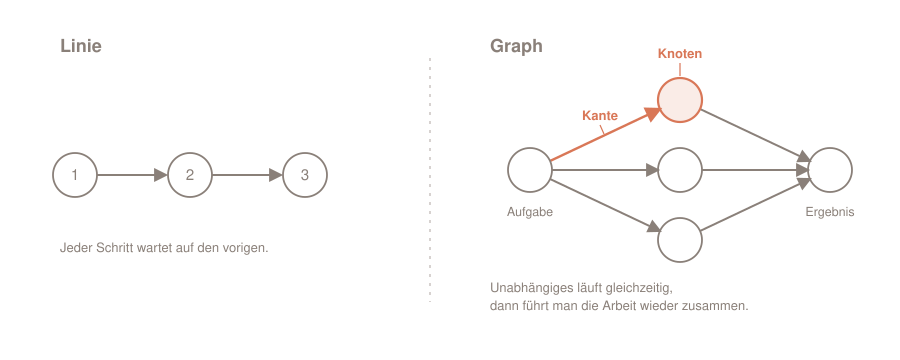

Das Thema „Graph Engineering" wird in meiner Tech-Bubble gerade stark gehyped. Aber was steckt wirklich dahinter?

**Unter dem Lärm steckt ein altes, simples Prinzip und ein echtes Werkzeug. Das Prinzip: Modelliere die Arbeit als Graph und lass unabhängige Zweige gleichzeitig laufen, statt sie in einer Linie aufeinander warten zu lassen. Mein Werkzeug dafür: die _Dynamic Workflows_ von Claude Code, bei denen Claude ein Orchestrierungs-Skript schreibt und die Arbeit auf viele Subagenten auffächert. Der Gewinn ist real, sobald die Arbeit wirklich ein Graph ist. Ist sie es nicht, kostet der Graph nur mehr.**

Das hier ist der dritte Blick in einer kleinen Serie. Erst ging es ums Prompt, dann um die Schleife (_Loop Engineering_), jetzt um den Graphen. Jeder Teil ist für sich lesbar.

## Inhalt

[[toc]]

## Von der Linie zum Graphen

Die meisten mehrstufigen Agenten arbeiten sequentiell! Schritt eins, Schritt zwei, Schritt drei, und jeder wartet, bis der vorige fertig ist. Das ist bequem und oft auch richtig. Manchmal aber ist es einfach nur langsam, und zwar aus einem Grund, den man leicht übersieht: Ein Teil der Schritte hätte gar nicht warten müssen.

Ein Graph beschreibt diese Struktur. Er hat nur zwei Bausteine:

- Ein **Knoten** (engl. *Node*) ist eine Arbeitseinheit: ein Agent, ein Auftrag, ein Ergebnis.
- Eine **Kante** (engl. *Edge*) ist eine Abhängigkeit: Das Ergebnis des einen Knotens ist die Eingabe des nächsten.

Der ganze Trick steckt in einer einzigen Frage. Für jedes „und dann" im Auftrag: Liest der nächste Schritt tatsächlich das Ergebnis des vorigen?

> **💡 Die Faustregel:** Fließen Daten von A nach B, ist das eine echte Kante, die Reihenfolge bleibt. Fließen keine Daten, ist es keine Kante, und das Warten ist verschenkt. Dann könnten A und B nebeneinander laufen.

Ein Beispiel für eine echte Kante: „Lies das Datenbankschema aus und generiere daraus die Typen." Der zweite Schritt braucht das Ergebnis des ersten. Die Reihenfolge bleibt.

Und eins ohne Kante: „Prüfe jede Route-Datei auf fehlende Auth-Checks." Keine Datei liest das Ergebnis einer anderen. Lauter unabhängige Aufgaben, die ein lineares Skript ohne Not hintereinanderhängt. Ein Graph lässt sie nebeneinander laufen.



Neu ist dieses Prinzip nicht. Build-Systeme wie `make` bauen seit Jahrzehnten aus genau solchen Abhängigkeiten einen Graphen und erledigen alles Unabhängige parallel. Und auch für Agenten hat es Anthropic längst nüchtern aufgeschrieben, in [„Building Effective Agents"](https://www.anthropic.com/engineering/building-effective-agents): dort heißt das Muster *Parallelization* (unabhängige Teilaufgaben gleichzeitig) und *Orchestrator-Workers* (eine zentrale Instanz zerlegt die Aufgabe, verteilt sie an Worker und fügt die Ergebnisse zusammen). Ein neues Wort braucht es dafür also nicht, und doch ist genau eines entstanden.

## Woher der Begriff kommt

Um den Begriff einzuordnen, halte ich mich an LangChain, die Firma hinter dem verbreiteten Agenten-Framework LangGraph. Sie [ordnet „Graph Engineering" selbst ein](https://www.langchain.com/blog/3-years-of-graph-engineering-with-langgraph): es sei „the latest term to come out of X's AI content factory", in einer Reihe mit Prompt Engineering, Context Engineering und Loop Engineering. Ein frisches Buzzword also.

Das Wort ist neu, die Sache nicht. Denselben Gedanken, ein Agentensystem als Graph zu bauen, hat LangChain vor drei Jahren zu LangGraph gemacht, das heute über 65 Millionen Mal im Monat heruntergeladen wird. Die Definition dort ist genau unsere: „nodes do work" (Knoten erledigen die Arbeit), „edges define what happens next" (Kanten bestimmen, was als Nächstes kommt), das Ganze als Zustandsmaschine. Das Buzzword steht also für eine erprobte Praxis.

Und das „Engineering" im Namen? Das ist der Teil, der am meisten verspricht und am wenigsten hält. Das echte Engineering steckt in den Werkzeugen, in LangGraph und in Claude Codes Runtime. Sie zu benutzen verlangt keins. Was für dich übrig bleibt, ist schlicht: parallele Agenten orchestrieren. So würde ich es lieber nennen.

Eine Verwechslung muss ich noch ausräumen. „Graph" ist in der KI-Welt doppelt belegt. Es meint auch Wissensgraphen für die Suche, wie in Microsofts [GraphRAG](https://www.microsoft.com/en-us/research/blog/graphrag-unlocking-llm-discovery-on-narrative-private-data/), wo aus Texten Entitäten und Beziehungen extrahiert werden. Das ist eine andere Baustelle: GraphRAG strukturiert Wissen, Graph Engineering steuert Abläufe zwischen Agenten.

Bleibt die Umsetzung. In Claude Code heißt das Werkzeug dafür Dynamic Workflows, und das Wort „Graph" fällt in der Dokumentation kein einziges Mal.

## Das Werkzeug dahinter: Dynamic Workflows

Die Dokumentation von Claude Code beschreibt sie [in einem Satz](https://code.claude.com/docs/en/workflows):

> A dynamic workflow is a JavaScript script that orchestrates many subagents at once. Claude writes the script for the task you describe, and a runtime executes it in the background while your session stays responsive.

Der entscheidende Unterschied zu allem anderen ist, **wer den Plan hält**. Bei einzelnen Subagenten, bei Skills, bei Agent-Teams ist Claude selbst der Dirigent: Es entscheidet Zug um Zug, was als Nächstes läuft, und jedes Zwischenergebnis landet im Kontextfenster. Beim Workflow hält das Skript den Plan. Die Schleifen, die Verzweigungen und vor allem die Zwischenergebnisse liegen in Skript-Variablen. Im Kontext bleibt am Ende nur die eine geprüfte Antwort.

Das ist der eigentliche Gewinn, und er ist größer als „mehr Agenten gleichzeitig". Weil die Orchestrierung Code ist, lässt sich ein wiederholbares Qualitätsmuster einbauen: unabhängige Agenten prüfen die Befunde der anderen gegen (engl. *adversarial review*), oder ein Plan wird aus mehreren Blickwinkeln entworfen und gegeneinander abgewogen. Ein Durchlauf, dem man eher trauen kann als einem einzelnen Schuss.

**Ausprobieren geht mit einem einzigen Befehl.** Am schnellsten sieht man es an `/deep-research`, dem mitgelieferten Workflow für Recherchefragen:

> **🛠️ Selbst ausprobieren**
> ```text
> /deep-research Was hat sich im Node.js-Permission-Model zwischen v20 und v22 geändert?
> ```
> Claude fächert die Suche über mehrere Richtungen auf, holt und kreuzprüft die Quellen und liefert am Ende einen belegten Bericht statt eines Zug-um-Zug-Protokolls. Mit `/workflows` schaust du dem Lauf live zu. Gefällt dir das Ergebnis, speicherst du das Skript mit `s`; künftig läuft es als eigener Befehl `/<name>`.

„Dynamic" meint dabei genau eines: Das feste Ablauf-Skript schreibt Claude selbst, dynamisch für deine Aufgabe. Ausgelöst wird so ein Workflow unter anderem auf diesen Wegen:

| Auslöser | Was passiert |
|---|---|
| `/deep-research <Frage>` | der einzige mitgelieferte Workflow: Recherche mit Quellen-Kreuzprüfung |
| `/<name>` | ein von dir gespeicherter Workflow, läuft als eigener Befehl |
| `ultracode` im Prompt (oder „nutze einen Workflow") | Claude schreibt einmalig einen Workflow für diese eine Aufgabe |
| `/effort ultracode` (Modus) | Claude plant ab dann für jede größere Aufgabe von allein einen Workflow |

Verfügbar ist das auf allen bezahlten Plänen; auf Pro schaltest du die Zeile _Dynamic workflows_ vorher in `/config` ein.

Wahrscheinlich löst du so etwas längst täglich aus, ohne den Begriff zu benutzen. Befehle wie `/code-review` und `/security-review` prüfen aus mehreren unabhängigen Blickwinkeln, einer für Bugs, einer für die Git-History, einer für die Konventionen. Gerade beim Review ist das goldrichtig, denn Perspektiven, die einander nicht beeinflussen sollen, lassen sich perfekt parallelisieren. Ob die Blickwinkel nacheinander im selben Kontext laufen oder als parallele Agenten, entscheidet Claude Code abhängig von Modell und Effort. Am oberen Ende wird daraus ein echter Workflow mit dem Muster von eben: Prüfer auffächern, jeden Fund von einem eigenen Agenten gegenprüfen, einen gerankten Bericht zusammentragen. Fan-out, Verify, Synthesize, ein Graph wie aus dem Lehrbuch.

> **💡 Tipp:** Wie stark `/code-review` auffächert, hängt an Modell und Effort. Den Effort gibst du direkt als erstes Argument mit, etwa `/code-review max`; ohne Angabe gilt der zuletzt getippte Level und sonst der Effort der Sitzung. Mehr Effort bedeutet mehr Prüf-Blickwinkel und ab `xhigh` eine zusätzliche Runde, die nur nach übersehenen Stellen sucht.

Und weil das Skript eine ganz normale Datei unter `~/.claude/projects/` ist, kannst du es lesen, mit einem früheren Lauf vergleichen oder von Hand anpassen und Claude neu starten lassen. Ein Graph ist damit nichts Magisches: nur Code, den du in die Hand nehmen kannst.

## Wann sich ein Graph lohnt, und wann nicht

Ein Graph zahlt sich aus, wenn die Arbeit von Natur aus breit ist. Die Doku nennt genau die Fälle, in denen es sich lohnt: ein Bug-Sweep über die ganze Codebasis, eine Migration über hunderte Dateien, eine Recherche, deren Quellen gegeneinander geprüft werden müssen, oder ein schwieriger Plan, den man erst aus mehreren Richtungen entwerfen will. Viele unabhängige Teilaufgaben, ein zusammengeführtes Ergebnis.

Genauso wichtig ist die andere Richtung. Ein Graph lohnt sich **nicht**, wenn die Schritte echt voneinander abhängen. Wo jeder Schritt das Ergebnis des vorigen braucht, ist die Linie die richtige Form, und ein Graph darüber bringt nichts außer Aufwand. Und für eine kleine Aufgabe ist die ganze Maschinerie schlicht zu viel.

> **⚠️ Der Kostenpunkt, den man dir gern verschweigt:** Man liest, ein Workflow koste praktisch nichts extra, weil die Zwischenergebnisse ja im Skript bleiben. Das ist die halbe Wahrheit. Gespart wird an der Koordination, nicht an der Arbeit. Die Doku ist da unmissverständlich: ein Workflow verbraucht *„meaningfully more tokens than working through the same task in conversation"*. Die Subagenten kosten. Deshalb: erst auf einem kleinen Ausschnitt laufen lassen, ein Verzeichnis statt des ganzen Repos, den Verbrauch in `/workflows` beobachten, dann erst breiter gehen.

Auch die Skala lohnt einen zweiten Blick. Die Standardgröße eines Workflows ist `medium`, also unter 15 Agenten; gleichzeitig laufen bis zu 16. Die Obergrenze von 1000 Agenten pro Lauf existiert allein dafür, eine außer Kontrolle geratene Schleife zu stoppen. Ein Zielwert ist sie nicht. Wer wirklich tausend Agenten auf einmal braucht, hat meist ein anderes Problem.

Dass ein breiter Fächer nicht immer die Antwort ist, sagt Anthropic selbst, im Beitrag [„When to use multi-agent systems (and when not to)"](https://claude.com/blog/building-multi-agent-systems-when-and-how-to-use-them). Ein Werkzeug wird nicht dadurch besser, dass man es überall einsetzt.

## Fazit

Wenn du also das nächste Mal von einem AI-Influencer das Wort „Graph Engineering" hörst, weißt du: Das hab ich längst, und einen Zwei-Stunden-Kurs muss ich dafür nicht buchen. Nein, es revolutioniert nicht alles Bisherige. Und schaltest du `ultracode` ein, startet Claude bei komplexen Aufgaben sogar von allein einen Workflow, wenn er sich lohnt. Sehr beruhigend.

Damit schließt sich die Serie. Drei Werkzeuge für drei Formen von Arbeit: Das **Prompt** bestimmt, wie du fragst. Die **Schleife** treibt eine Linie in die Tiefe, immer weiter, bis das Ziel steht ([Loop Engineering](https://agentic.schule/blog/2026-07-loop-engineering)). Der **Graph** fächert unabhängige Arbeit in die Breite. Das eine ist nicht der Nachfolger des anderen, sie lösen verschiedene Probleme.

Mein Rat ist wie immer der undramatische: Fang klein an. Ein `/deep-research` zu einer echten Frage, oder ein Audit über ein einzelnes Verzeichnis. Schau in `/workflows` auf den Verbrauch, lies das Skript, das Claude geschrieben hat, und urteile selbst, ob deine Arbeit gerade eine Linie ist oder ein Graph.

Und wirft demnächst ein Kollege mit dem Buzzword um sich? Schick ihm einfach diesen Artikel. 😄

**Fragen, Feedback, eigene Workflows?** Immer her damit, ich freue mich über jede Nachricht.

---

*Neugierig auf agentisches Arbeiten in der Praxis? In den Workshops von [agentic.schule](https://agentic.schule) und [angular.schule](https://angular.schule) zeigen wir, wie moderne KI-Agenten die tägliche Entwicklung verändern.*
