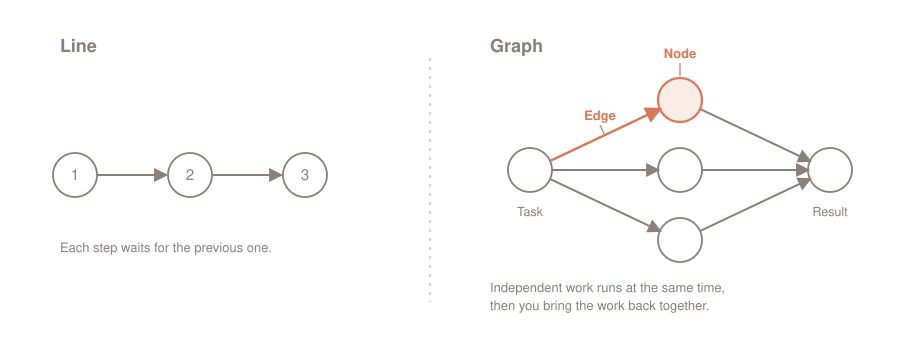

The topic "graph engineering" is being hyped hard in my tech bubble right now. But what is really behind it?

**Underneath the noise sits an old, simple principle and a real tool. The principle: model the work as a graph and let independent branches run at the same time, instead of making them wait for each other in a line. My tool for it: Claude Code's _Dynamic Workflows_, where Claude writes an orchestration script and fans the work out across many subagents. The gain is real as soon as the work actually is a graph. If it is not, the graph only costs more.**

This is the third look in a small series. First came the prompt, then the loop (_Loop Engineering_), now the graph. Each part stands on its own.

## Contents

[[toc]]

## From the line to the graph

Most multi-step agents work sequentially! Step one, step two, step three, and each one waits until the previous one is done. That is convenient and often also correct. Sometimes, though, it is just slow, for a reason that is easy to miss: some of the steps never needed to wait.

A graph describes this structure. It has only two building blocks:

- A **node** is a unit of work: an agent, a task, a result.
- An **edge** is a dependency: one node's result is the next node's input.

The whole trick sits in a single question. For every "and then" in the task: does the next step actually read the previous step's result?

> **💡 Rule of thumb:** if data flows from A to B, that is a real edge and the order stays. If no data flows, it is not an edge, and the waiting is wasted. A and B could then run side by side.

An example of a real edge: "Read the database schema and generate the types from it." The second step needs the first step's result. The order stays.

And one without an edge: "Check every route file for missing auth checks." No file reads another file's result. Nothing but independent tasks that a linear script chains together for no reason. A graph lets them run side by side.



This principle is not new. Build systems like `make` have been turning exactly these dependencies into a graph for decades, running everything independent in parallel. And for agents, Anthropic wrote it down matter-of-factly a while ago, in ["Building Effective Agents"](https://www.anthropic.com/engineering/building-effective-agents): there the pattern is called *parallelization* (independent subtasks at the same time) and *orchestrator-workers* (a central instance breaks the task down, hands it to workers and merges the results). So no new word is needed for it, and yet exactly one has emerged. (My guess: because it sounds cool.)

## Where the term comes from

To place the term, I go by LangChain, the company behind the widespread agent framework LangGraph. It [classifies "graph engineering" itself](https://www.langchain.com/blog/3-years-of-graph-engineering-with-langgraph): it is "the latest term to come out of X's AI content factory", in line with prompt engineering, context engineering and loop engineering. A fresh buzzword, then.

The word is new, the thing is not. The very idea of building an agent system as a graph is what LangChain turned into LangGraph three years ago, downloaded more than 65 million times a month today. The definition there is exactly ours: "nodes do work", "edges define what happens next", the whole thing as a state machine. So the buzzword stands for a proven practice.

And the "engineering" in the name? That is the part that promises the most and delivers the least. The real engineering sits in the tools, in LangGraph, in Claude Code's runtime and the other harnesses. Using the tools requires no "engineering" skills. That is nonsense. Personally, I prefer the term: **orchestrating parallel agents**.

One mix-up still needs clearing. "Graph" is doubly booked in the AI world. It also means knowledge graphs for retrieval, as in Microsoft's [GraphRAG](https://www.microsoft.com/en-us/research/blog/graphrag-unlocking-llm-discovery-on-narrative-private-data/), where entities and relations are extracted from text. That is a different construction site: GraphRAG structures knowledge, graph engineering steers workflows between agents.

That leaves the implementation. In Claude Code the tool for it is called Dynamic Workflows, and the word "graph" does not appear in the documentation a single time.

## Workflows: the script holds the plan

In Claude Code, a workflow is a JavaScript script that orchestrates many subagents at once. Finished workflows are invoked like any other command.

The decisive difference to everything else is **who holds the plan**. With individual subagents, with skills, with agent teams, Claude itself is the conductor: it decides turn by turn what runs next, and every intermediate result lands in the context window. With a workflow, the script holds the plan. The loops, the branching and above all the intermediate results live in script variables. In the end, the context holds only the one verified answer.

That is the actual gain, and it is bigger than "more agents at once". Because the orchestration is code, a repeatable quality pattern can be built in: independent agents cross-check each other's findings (*adversarial review*), or a plan is drafted from several angles and weighed against itself. A run you can trust more than a single shot.

The quickest way to see it is `/deep-research`, the bundled workflow for research questions:

> **🛠️ Try it yourself**
> ```text
> /deep-research What changed in the Node.js permission model between v20 and v22?
> ```
> Claude fans the search out across several angles, fetches and cross-checks the sources, and delivers a cited report at the end instead of a turn-by-turn transcript. With `/workflows` you watch the run live.

The `/workflows` slash command behind it is the control center. The command lists running and completed workflows, and the detail view shows every phase with its agents, token usage and elapsed time. From there you stop a run, resume it, or save it for later.

## Dynamic Workflows: Claude writes the script

That leaves the question of where such a script comes from. You could write it by hand. It is meant to work the other way round, and that is exactly what "dynamic" means: you describe the task, and Claude writes the workflow for it. The documentation says it [in one sentence](https://code.claude.com/docs/en/workflows):

> A dynamic workflow is a JavaScript script that orchestrates many subagents at once. Claude writes the script for the task you describe, and a runtime executes it in the background while your session stays responsive.

If you save a good run, with the `s` key in `/workflows`, it becomes a fixed command again, just like `/deep-research`. Such a workflow is triggered, among other ways, like this:

| Trigger | Kind | What happens |
|---|---|---|
| `/deep-research <question>` | finished | the only bundled workflow: research with source cross-checking |
| `/<name>` | finished | a workflow you saved, running as its own command |
| `ultracode` in the prompt (or "use a workflow") | dynamic | Claude writes a one-off workflow for this one task |
| `/effort ultracode` (mode) | dynamic | from then on, Claude plans a workflow for every larger task on its own |

It is available on all paid plans; on Pro you first switch on the _Dynamic workflows_ row in `/config`.

You probably trigger something like this every day already, without using the term. Commands like `/code-review` and `/security-review` check from several independent angles, one for bugs, one for the git history, one for the conventions. For a review that is exactly right, because perspectives that must not influence each other are perfect to parallelize. Whether the angles run one after another in the same context or as parallel agents is decided by Claude Code depending on model and effort. At the top end it becomes a real workflow with the pattern from above: fan out the reviewers, have every finding cross-checked by its own agent, compile a ranked report. Fan out, verify, synthesize, a graph straight from the textbook.

> **💡 Tip:** How far `/code-review` fans out depends on model and effort. You pass the effort directly as the first argument, for instance `/code-review max`; without it, the last level you typed applies, and otherwise the session's effort. More effort means more review angles, and from `xhigh` on an extra round that hunts only for missed spots.

How big the difference is, I saw for myself while writing this article. Because of course this very text went through the grinder, with a German prompt asking for an intensive review of all the repo's texts, covering spelling, grammar, style, truth and the English translation:

```text
/code-review max mache einen intensiven review aller Texte dieses repos. prüfe: Rechtschreibung, Grammatikfehler, Stil, Wahrheit und Übersetzung ins Englische
```

With `max` on Fable 5, the review fanned out into parallel review agents, tailored to the request: one for German orthography, one for polishing the English, one for comparing the two versions, more for fact-checking against the Anthropic docs and against external sources. Without the `max`, at `xhigh` on Opus 4.8, the same command ran as a line instead and worked through its angles one after another in the same context. Both times a list of genuine findings came back, from a skewed factual claim to a grammar mistake in the translation. And by the way: `/code-review` may be called code review, but it works just as well for article texts.

And because the script is an ordinary file under `~/.claude/projects/`, you can read it, diff it against an earlier run, or edit it by hand and have Claude relaunch it. A graph is nothing magical this way: just code you can take into your own hands.

## When a graph is worth it, and when not

A graph pays off when the work is broad by nature. The docs name exactly the cases where it is worth it: a bug sweep across the whole codebase, a migration across hundreds of files, a research question whose sources need to be checked against each other, or a hard plan you want drafted from several angles first. Many independent subtasks, one merged result.

The other direction matters just as much. A graph is **not** worth it when the steps genuinely depend on each other. Where every step needs the previous step's result, the line is the right shape, and a graph on top brings nothing but overhead. And for a small task the whole machinery is simply too much.

> **⚠️ The cost point people like to keep from you:** You read that a workflow costs practically nothing extra, because the intermediate results stay in the script. That is half the truth. The saving is in the coordination, not in the work. The docs are unambiguous here: a workflow uses *"meaningfully more tokens than working through the same task in conversation"*. The subagents cost. So: run it on a small slice first, one directory instead of the whole repo, watch the usage in `/workflows`, and only then go broader.

The scale deserves a second look too. A workflow's default size is `medium`, meaning fewer than 15 agents; up to 16 run at the same time. The ceiling of 1000 agents per run exists solely to stop a loop that has run out of control. It is not a target. If you really need a thousand agents at once, you usually have a different problem.

That a wide fan is not always the answer is something Anthropic says itself, in the post ["When to use multi-agent systems (and when not to)"](https://claude.com/blog/building-multi-agent-systems-when-and-how-to-use-them). A tool does not get better by being used everywhere.

## Conclusion

So the next time you hear an AI influencer say "graph engineering", you know: I already have all of that, and I do not need to book a two-hour course for it. No, it does not revolutionize everything that came before. And if you switch on `ultracode`, Claude even starts a workflow on its own for complex tasks, whenever one is worth it. Very reassuring.

That closes the series. Three tools for three shapes of work: the **prompt** determines how you ask. The **loop** drives a line into the depth, on and on, until the goal stands ([Loop Engineering](https://agentic.schule/blog/2026-07-loop-engineering)). The **graph** fans independent work out into the breadth. One is not the successor of the other; they solve different problems.

My advice is the undramatic one, as always: start small. A `/deep-research` on a real question, or an audit across a single directory. Watch the usage in `/workflows`, read the script Claude wrote, and judge for yourself whether your work right now is a line or a graph.

And if a colleague starts throwing the buzzword around soon? Just send them this article. 😄

**Questions, feedback, workflows of your own?** Bring them on, I am glad to hear from you.

---

*Curious about agentic work in practice? In the workshops at [agentic.schule](https://agentic.schule) and [angular.schule](https://angular.schule) we show how modern AI agents are changing everyday development.*
