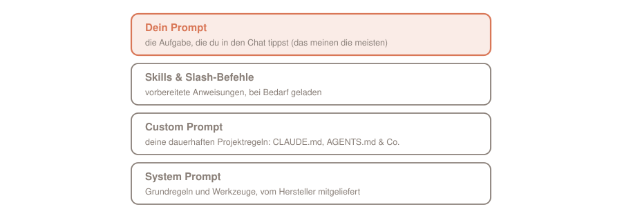
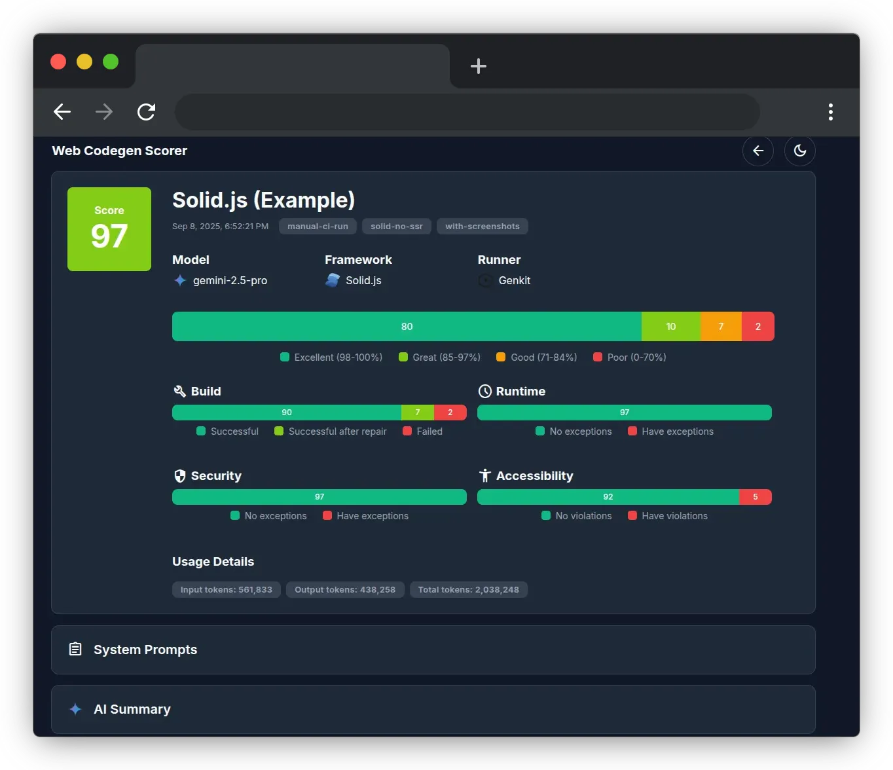

Garbage in, garbage out: Kaum ein Satz der Informatik passt so gut auf Sprachmodelle. Was das Modell zu sehen bekommt, bestimmt, was herauskommt. Müll wollen wir nicht. Schauen wir uns also an, was gute Prompts und guten Kontext ausmacht.

**Dafür kursieren gleich zwei Hype-Begriffe: Prompt Engineering und Context Engineering. Doch hinter beiden steckt tatsächlich echtes Handwerk. Prompt Engineering: Formuliere die Anweisung klar, belege sie mit Beispielen und miss das Ergebnis. Context Engineering: Kuratiere alles, was das Modell zu sehen bekommt, denn das Kontextfenster ist eine endliche Ressource.**

Das hier ist der Auftakt der kleinen Serie über die Engineering-Begriffe der Agenten-Welt. Danach geht es weiter mit der Schleife ([Loop Engineering](https://agentic.schule/blog/2026-07-loop-engineering)) und dem Graphen ([Graph Engineering](https://agentic.schule/blog/2026-09-graph-engineering)). Jeder Teil ist für sich lesbar.

## Inhalt

[[toc]]

## Woher die Begriffe kommen

Prompt Engineering ist der ältere der beiden Begriffe und längst etabliert: Jeder große Anbieter pflegt eine eigene Anleitung dazu, [Anthropic](https://platform.claude.com/docs/en/build-with-claude/prompt-engineering/overview) genauso wie [OpenAI](https://developers.openai.com/api/docs/guides/prompt-engineering) und [Google](https://ai.google.dev/gemini-api/docs/prompting-strategies). Wer es akademisch mag: Der Survey [„The Prompt Report"](https://arxiv.org/abs/2406.06608) katalogisiert allein für Text eine Taxonomie von 58 Prompting-Techniken.

Der Begriff Context Engineering ist dagegen jung, und seine Herkunft lässt sich auf die Woche genau datieren. Am 19. Juni 2025 schreibt Shopify-Chef Tobi Lütke [auf X](https://x.com/tobi/status/1935533422589399127): „I really like the term “context engineering” over prompt engineering. It describes the core skill better: the art of providing all the context for the task to be plausibly solvable by the LLM." Sechs Tage später legt Andrej Karpathy [mit seinem „+1"](https://x.com/karpathy/status/1937902205765607626) nach und definiert: „context engineering is the delicate art and science of filling the context window with just the right information for the next step". Im September 2025 zieht Anthropic mit einem eigenen [Engineering-Beitrag](https://www.anthropic.com/engineering/effective-context-engineering-for-ai-agents) nach und erklärt den Begriff zur offiziellen Linie: „At Anthropic, we view context engineering as the natural progression of prompt engineering."

Zur Einordnung: Das ist Anthropics Rahmung, kein Industriestandard. Es ist aber eine gute Definition, und an ihr arbeite ich mich in diesem Artikel entlang.

## Welcher Prompt eigentlich?

Bevor es an die Techniken geht, eine Klärung, denn das Wort Prompt bezeichnet je nach Zusammenhang verschiedene Dinge. Tatsächlich stapeln sich in einer Agenten-Sitzung mehrere Prompts übereinander:

- **System Prompt:** die Grundregeln, die der Hersteller des Werkzeugs mitliefert. Bei Claude Code bringt das Tool ihn fertig mit.
- **Custom Prompt:** deine dauerhaften Projektregeln in Dateien wie der `CLAUDE.md` (andere Werkzeuge nutzen `AGENTS.md` oder `.cursorrules`).
- **Skills und Slash-Befehle:** vorbereitete Anweisungen, die bei Bedarf dazugeladen werden.
- **Dein Prompt:** das, was die meisten meinen, wenn sie „Prompt" sagen. Die Aufgabe, die du in den Chat tippst.

Obendrauf wächst mit jeder Runde der Verlauf: Claudes Antworten und Reasoning, die Tool-Aufrufe samt Ergebnissen. Alle Schichten landen im selben Kontextfenster, und deshalb gelten die Techniken dieses Artikels für alle: Ob du eine `CLAUDE.md` pflegst, einen Skill schreibst oder eine Aufgabe tippst, du schreibst immer einen Prompt. Nur die unterste Schicht ist meist außerhalb deiner Reichweite: Bei gehosteten Modellen ist der System Prompt immer da. Wer dagegen ein lokales Modell betreibt, etwa mit Ollama, hat auch diese Schicht selbst in der Hand. Im Alltag mit Claude Code sind deine Hebel also die Schichten darüber. Den Stapel kannst du dir sogar ansehen: Der Befehl `/context` schlüsselt das Kontextfenster nach diesen Schichten auf. Die Grundlagen dazu habe ich in den Artikeln über [Agentic Coding](https://agentic.schule/blog/2026-02-agentic-coding) und [Claude Code](https://agentic.schule/blog/2026-02-claude-code) beschrieben.

## Prompt Engineering: schreiben, messen, verfeinern

Die Anthropic-Doku beschreibt Prompt Engineering als empirische, iterative Disziplin. Bevor du überhaupt am Prompt feilst, brauchst du laut [Overview-Seite](https://platform.claude.com/docs/en/build-with-claude/prompt-engineering/overview) drei Dinge: klare Erfolgskriterien, eine Möglichkeit, empirisch dagegen zu testen, und einen ersten Entwurf. Dann läuft der Zyklus: Testfälle schreiben, Prompt bauen, gegen die Tests verfeinern, validieren, ausliefern. Die Doku nennt diesen Kreislauf wörtlich „central to prompt engineering". Mit Tests sind dabei keine Unit-Tests gemeint, sondern sogenannte *Evals* ([Evaluations](https://platform.claude.com/docs/en/test-and-evaluate/develop-tests)): Testfragen, die messen, wie gut der Prompt die vorher definierten Erfolgskriterien erfüllt. Bewertet wird laut Doku per Code (etwa der exakte Vergleich mit einer Musterlösung), durch Menschen oder durch ein LLM als Gutachter.

Diesen Zyklus fährst du vermutlich längst, ohne ihn so zu nennen: Du liest den erzeugten Code. Gefällt er dir, bleiben die Regeln in der `CLAUDE.md`, gefällt er dir nicht, schärfst du nach. Das ist ein Eval mit dir als einzigem Gutachter und einer Rubrik, die nur in deinem Kopf existiert. Die Doku stuft genau dieses Vorgehen allerdings als die schwächste Variante ein, beim Human grading steht wörtlich: „Most flexible and high quality, but slow and expensive. Avoid if possible." Dazu kommt: Du beurteilst nur den einen Fall vor deinen Augen. Ob die Änderung an der `CLAUDE.md` die übrigen Fälle verbessert oder verschlechtert hat, siehst du nicht.

Gute Prompts entstehen also durch Messen, und zwar an vielen Fällen statt an einem. Beim Testdesign empfiehlt Anthropic ausdrücklich Masse mit automatischer Bewertung: „More questions with slightly lower signal automated grading is better than fewer questions with high-quality human hand-graded evals."

> **💡 Praxis-Tipp:** Du brauchst dafür kein Framework. Das offizielle [Evals-Cookbook](https://platform.claude.com/cookbook/misc-building-evals) zerlegt einen Eval in vier Teile: Eingabe, Modell-Antwort, Musterlösung („golden answer") und Bewertung, und zeigt lauffähigen Beispiel-Code für alle drei Bewertungsarten. Für den Hausgebrauch reicht eine Datei mit Beispiel-Aufgaben und ein Skript, das sie nach jeder Prompt-Änderung durchs Modell schickt und die Antworten vergleicht. Das funktioniert auch für deine `CLAUDE.md`: Sammle die Aufgaben, bei denen der Agent danebenlag, und lass sie nach jeder Regeländerung erneut laufen. Eine Nummer größer ist der [Web Codegen Scorer](https://github.com/angular/web-codegen-scorer) vom Angular-Team: ein fertiges Eval-Werkzeug für generierten Web-Code, mit dem du verschiedene Anweisungen und Modelle gegeneinander antreten lässt, samt eingebauter Checks für Build-Erfolg, Laufzeitfehler, Accessibility und Security. Als Runner unterstützt es neben direkten API-Aufrufen auch `claude-code`, `gemini-cli` und `codex`.

  
  

*So sehen Eval-Ergebnisse aus: zwei Läufe im Report-Viewer des Web Codegen Scorers, links Angular, rechts Solid.js. (Screenshots aus dem Projekt, MIT-lizenziert.)*

Und die Prompt-Engineering-Doku zieht selbst die Grenze: „Not every success criteria or failing eval is best solved by prompt engineering." Latenz und Kosten verbesserst du oft leichter über die Modellwahl als über den Prompt. Wenn eine Doku die Grenzen der eigenen Methode so offen benennt, spricht das für sie.

## Die Techniken, die tragen

Anthropic pflegt alle Techniken auf einer einzigen Seite, den [Prompting best practices](https://platform.claude.com/docs/en/build-with-claude/prompt-engineering/claude-prompting-best-practices), von der Doku selbst „the living reference" genannt. Der Kern in vier Regeln:

- **Sei explizit.** Gewünschtes Verhalten ausdrücklich anfordern, statt es das Modell aus vagen Formulierungen raten zu lassen: „If you want "above and beyond" behavior, explicitly request it".
- **Liefere das Warum mit.** Eine Anweisung mit Begründung trifft besser, denn „Claude is smart enough to generalize from the explanation".
- **Zeige Beispiele.** Wenige gut gewählte Beispiele (*Few-Shot-Prompting*) sind laut Doku eine der zuverlässigsten Methoden, Format, Ton und Struktur zu steuern. Der Tipp dort: drei bis fünf Stück, relevant und divers, eingepackt in `<example>`-Tags.
- **Strukturiere mit XML-Tags.** `<instructions>`, `<context>`, `<input>`: Wenn ein Prompt Anweisungen, Kontext, Beispiele und variable Eingaben mischt, verhindern Tags, dass das Modell sie durcheinanderwirft.

Und was ist mit Verboten? Die offizielle Linie: „Tell Claude what to do instead of what not to do". Statt „Do not use markdown in your response" empfiehlt die Doku die positive Fassung „Your response should be composed of smoothly flowing prose paragraphs." Auffällig dabei: Anthropic hält sich selbst nicht dogmatisch daran, die Beispiel-Prompts derselben Seite sind voll mit „DO NOT", „NEVER" und „Avoid". Das Muster in diesen Beispielen: Das Verbot steht fast nie allein, direkt daneben steht die erwünschte Alternative oder eine Ausnahmebedingung. Negativbeispiele fürs Few-Shot-Prompting empfiehlt die Doku dagegen nirgends; die Kriterien für Beispiele sind relevant, divers und strukturiert.

Dazu kommt die Anordnung bei langen Eingaben: Die Dokumente gehören an den Anfang und die Frage ans Ende. Laut Anthropic verbessert die Frage am Ende die Antwortqualität in internen Tests um bis zu 30 Prozent, gerade bei mehreren Dokumenten. Die Methodik dahinter ist nicht veröffentlicht, die Richtung deckt sich aber mit der Forschung: Das Paper [„Lost in the Middle"](https://arxiv.org/abs/2307.03172) zeigt, dass Modelle Informationen am Anfang und am Ende des Kontexts deutlich besser abrufen als in der Mitte.

## Context Engineering: die Fortsetzung

Warum reicht der gute Prompt nicht mehr? Weil ein Agent nicht nur einen Prompt sieht. In seinem Kontextfenster stapeln sich System Prompt, Werkzeug-Beschreibungen, Dateiinhalte, Suchergebnisse und der gesamte bisherige Verlauf. Anthropic definiert Context Engineering deshalb als „the set of strategies for curating and maintaining the optimal set of tokens (information) during LLM inference".

Der Gegenspieler hat auch einen Namen: *Context Rot*. „as the number of tokens in the context window increases, the model’s ability to accurately recall information from that context decreases", so der Beitrag. Mehr Kontext ist also nicht automatisch besser, ab einem Punkt wird er schlechter.

Daraus folgt das Leitprinzip, und es ist herrlich unbequem: „finding the smallest possible set of high-signal tokens that maximize the likelihood of some desired outcome". Drei Konsequenzen aus dem Beitrag:

- **System Prompts auf der richtigen Flughöhe.** Zwischen zwei Fehlerbildern: hart verdrahtete Wenn-dann-Logik, die bei jeder Änderung bricht, und vages Blabla, das keine Signale gibt. Gesucht ist die Mitte, spezifisch genug zum Steuern, flexibel genug zum Denken. Dieselbe Flughöhe gilt für deine `CLAUDE.md`.
- **Weniger Werkzeuge, klar getrennt.** Aufgeblähte Tool-Sammlungen mit überlappenden Zuständigkeiten sind laut Anthropic eines der häufigsten Fehlerbilder: „If a human engineer can't definitively say which tool should be used in a given situation, an AI agent can't be expected to do better."
- **Beispiele statt Regelkataloge.** Wenige kanonische Beispiele steuern das Verhalten besser als eine Litanei aus Edge Cases. Die Doku bringt es auf die schönste Formel des ganzen Themas: „For an LLM, examples are the “pictures” worth a thousand words."

Nebenbei ist das Thema inzwischen im Modell selbst angekommen: Claude Sonnet 5, Sonnet 4.6, Sonnet 4.5 und Haiku 4.5 verfolgen laut [Doku](https://platform.claude.com/docs/en/build-with-claude/context-windows#context-awareness) ihr verbleibendes Token-Budget während der Konversation, *Context Awareness* genannt. Das Modell weiß also, wie voll sein eigenes Fenster ist.

## Ressourcen zum Selbstabholen

Kuratieren heißt übrigens nicht, dass du dem Modell alles vorkauen musst. Ein Agent holt sich seinen Kontext zur Laufzeit selbst: Er navigiert durch Dateien, folgt Verweisen und lädt nur, was er gerade braucht. Anthropic nennt das die „just in time"-Strategie. Der Agent hält leichte Verweise wie Dateipfade, gespeicherte Abfragen und Weblinks und lädt die Inhalte erst bei Bedarf über seine Werkzeuge nach. Jede Erkundung liefert dabei Hinweise für die nächste, *progressive disclosure* genannt: Der Agent baut sein Verständnis Schicht für Schicht auf, statt in einem vollgestopften Fenster zu ertrinken.

Damit verschiebt sich deine Aufgabe: Du stellst gute Ressourcen bereit und machst sie auffindbar. Eine gepflegte README, Wiki-Inhalte, Beispiel-Komponenten, ein Ordner mit Referenz-Implementierungen: All das ist Kontext, den sich der Agent im richtigen Moment selbst zieht. Sogar die Metadaten arbeiten mit. Anthropics Beispiel: Eine Datei `test_utils.py` im `tests`-Ordner hat erkennbar einen anderen Zweck als dieselbe Datei unter `src/core_logic/`, denn „Folder hierarchies, naming conventions, and timestamps all provide important signals". Ein aufgeräumtes Repository mit sprechenden Namen ist also selbst schon Context Engineering.

Der Beitrag benennt auch den Preis: Erkundung zur Laufzeit ist langsamer, und ohne die richtigen Werkzeuge und Heuristiken verschwendet ein Agent Kontext in Sackgassen. Der Beitrag beschreibt deshalb eine Hybrid-Strategie, und Claude Code ist das Anschauungsbeispiel: Die `CLAUDE.md`-Dateien landen vorab komplett im Kontext, alles andere holt sich der Agent mit `glob` und `grep` just in time.

## Für lange Strecken: drei Techniken

Für Agenten, die über Stunden arbeiten, reicht auch das beste Kuratieren irgendwann nicht mehr, das Fenster läuft trotzdem voll. Der Anthropic-Beitrag nennt für diesen Fall genau drei Techniken: „compaction, structured note-taking, and multi-agent architectures".

**Compaction:** Läuft das Fenster voll, wird der Verlauf zusammengefasst und ein frisches Fenster mit der Zusammenfassung gestartet. Claude Code macht genau das, es bewahrt dabei laut Beitrag Architektur-Entscheidungen, offene Bugs und Implementierungsdetails und verwirft redundante Werkzeug-Ausgaben, dazu kommen die fünf zuletzt benutzten Dateien.

**Structured Note-Taking:** Der Agent schreibt Notizen außerhalb des Kontextfensters und liest sie später wieder ein, eine To-do-Liste, eine `NOTES.md`. Anthropics Anschauungsbeispiel: Claude spielt Pokémon und hält über Tausende Spielschritte Karten, Ziele und Kampfstrategien in eigenen Notizen fest, die jeden Kontext-Reset überleben.

**Multi-Agent-Architekturen:** Statt dass ein Agent alles im eigenen Fenster hält, erledigen Sub-Agenten fokussierte Teilaufgaben mit frischem Fenster und geben nur eine destillierte Zusammenfassung zurück. Mehr dazu im [Graph-Artikel](https://agentic.schule/blog/2026-09-graph-engineering).

## Du machst das längst

Falls dir das alles bekannt vorkommt: Claude Code setzt diese Techniken im Alltag um, und du benutzt sie mit. Die `CLAUDE.md` ist kuratierter Dauer-Kontext, genau das „smallest possible set of high-signal tokens" für dein Projekt. Die Kompaktierung springt automatisch an, wenn das Fenster voll läuft, und mit `/compact` stößt du sie selbst an. Die To-do-Listen des Agenten sind Note-Taking. Und Subagenten samt Workflows sind die Multi-Agent-Architektur.

> **💡 Merke:** Wenn der nächste Prompt zäh läuft, füge nicht als Erstes mehr Worte hinzu. Prüfe zuerst, was das Modell gerade alles sieht. Meist ist das Fenster das Problem, und dann hilft Kuratieren mehr als Formulieren.

## Fazit

Zwei Buzzwords, ein Handwerk. Prompt Engineering heißt: klare Anweisung, Beispiele, gemessen an Evals. Context Engineering heißt: Das Fenster ist endlich, also kuratiere, was hineinkommt, knapp und informativ. Beides steht frei zugänglich in den Primärquellen, und keines von beiden braucht einen bezahlten Kurs. (Außer bei der [agentic.schule](https://agentic.schule)! 😉)

Dieser Artikel ist der erste Teil der Serie: **Prompt und Kontext** bestimmen, was das Modell sieht. Weiter geht es mit der **Schleife**, die eine Linie in die Tiefe treibt, bis das Ziel steht ([Loop Engineering](https://agentic.schule/blog/2026-07-loop-engineering)), und dem **Graphen**, der unabhängige Arbeit in die Breite fächert ([Graph Engineering](https://agentic.schule/blog/2026-09-graph-engineering)). Drei Werkzeuge, drei Formen von Arbeit, und alle drei fangen mit derselben Frage an: Was muss das Modell wissen, um den nächsten Schritt gut zu machen?

**Fragen, Feedback, eigene Prompt-Rezepte?** Immer her damit, ich freue mich über jede Nachricht.

---

*Neugierig auf agentisches Arbeiten in der Praxis? In den Workshops von [agentic.schule](https://agentic.schule) und [angular.schule](https://angular.schule) zeigen wir, wie moderne KI-Agenten die tägliche Entwicklung verändern.*
