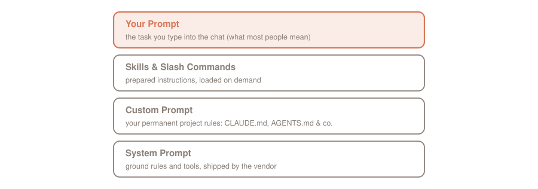
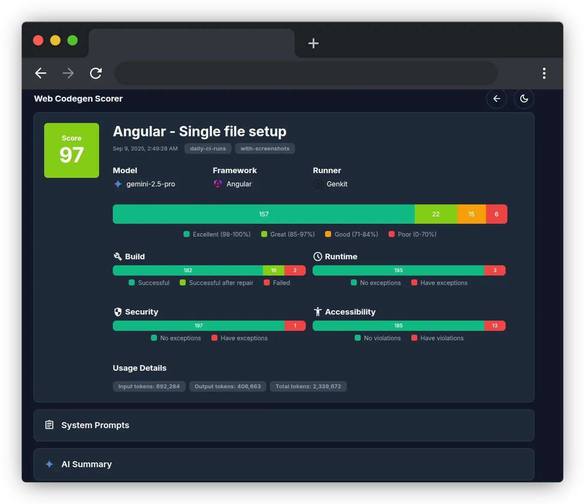

Garbage in, garbage out: hardly any phrase from computer science fits language models better. What the model gets to see determines what comes out. We don't want garbage. So let's look at what makes good prompts and good context.

**There are two hype terms in circulation for exactly that: prompt engineering and context engineering. Yet behind both lies real craft. Prompt engineering: phrase the instruction clearly, back it with examples, and measure the result. Context engineering: curate everything the model gets to see, because the context window is a finite resource.**

This is the opening part of the series about the engineering terms of the agent world. It continues with the loop ([Loop Engineering](https://agentic.schule/blog/2026-07-loop-engineering)) and the graph ([Graph Engineering](https://agentic.schule/blog/2026-09-graph-engineering)). Each part stands on its own.

## Contents

[[toc]]

## Where the terms come from

Prompt engineering is the older of the two terms and long established: every major vendor maintains its own guide, [Anthropic](https://platform.claude.com/docs/en/build-with-claude/prompt-engineering/overview) as well as [OpenAI](https://developers.openai.com/api/docs/guides/prompt-engineering) and [Google](https://ai.google.dev/gemini-api/docs/prompting-strategies). If you like it academic: the survey ["The Prompt Report"](https://arxiv.org/abs/2406.06608) catalogs a taxonomy of 58 prompting techniques for text alone.

The term context engineering, on the other hand, is young, and its origin can be dated to the week. On June 19, 2025, Shopify CEO Tobi Lütke wrote [on X](https://x.com/tobi/status/1935533422589399127): "I really like the term “context engineering” over prompt engineering. It describes the core skill better: the art of providing all the context for the task to be plausibly solvable by the LLM." Six days later, Andrej Karpathy, founding member of OpenAI and former head of AI at Tesla, followed up [with his "+1"](https://x.com/karpathy/status/1937902205765607626) and defined: "context engineering is the delicate art and science of filling the context window with just the right information for the next step". In September 2025, Anthropic followed with an [engineering post](https://www.anthropic.com/engineering/effective-context-engineering-for-ai-agents) of its own and made the term the official line: "At Anthropic, we view context engineering as the natural progression of prompt engineering."

For the record: that is Anthropic's framing, not an industry standard. But it is a good definition, and I work my way along it in this article.

## Which prompt, exactly?

Before we get to the techniques, a clarification, because the word prompt means different things depending on the context. In an agent session, several prompts are actually stacked on top of each other:

- **System Prompt:** the ground rules shipped by the maker of the tool. In Claude Code, the tool brings it along ready-made.
- **Custom Prompt:** your permanent project rules in files like `CLAUDE.md` (other tools use `AGENTS.md` or `.cursorrules`).
- **Skills and slash commands:** prepared instructions that are loaded on demand.
- **Your prompt:** what most people mean when they say "prompt". The task you type into the chat.

On top of all that, the history grows with every turn: Claude's answers and reasoning, the tool calls with their results. All layers land in the same context window, which is why the techniques in this article apply to every one of them: whether you maintain a `CLAUDE.md`, write a skill, or type a task, you are always writing a prompt. Only the bottom layer is usually out of your reach: with hosted models, the system prompt is always there. If you run a local model instead, say with Ollama, you hold that layer in your own hands as well. In everyday work with Claude Code, your levers are the layers above. You can even inspect the stack: the `/context` command breaks the context window down along these layers. I covered the foundations in my articles on [Agentic Coding](https://agentic.schule/blog/2026-02-agentic-coding) and [Claude Code](https://agentic.schule/blog/2026-02-claude-code).

## Prompt engineering: write, measure, refine

The Anthropic docs describe prompt engineering as an empirical, iterative discipline. Before you even start polishing your prompt, [in Anthropic's view](https://platform.claude.com/docs/en/build-with-claude/prompt-engineering/overview) you need three things:

1. clear success criteria
2. a way to test against them empirically
3. a first draft

Then the cycle runs: write test cases, build the prompt, refine against the tests, validate, ship. The docs literally call this loop "central to prompt engineering". Tests here do not mean unit tests but so-called *evals* ([evaluations](https://platform.claude.com/docs/en/test-and-evaluate/develop-tests)): test questions that measure how well the prompt meets the success criteria you defined up front. According to the docs, grading is done by code (say, an exact match against a golden answer), by humans, or by an LLM acting as judge.

You are probably running this cycle already without calling it that: you read the generated code. If you like it, the rules stay in the `CLAUDE.md`; if you don't, you sharpen them. That is an eval with you as the only grader and a rubric that exists only in your head. The docs, however, rate exactly this approach as the weakest variant; under human grading it literally says: "Most flexible and high quality, but slow and expensive. Avoid if possible." On top of that: you only judge the one case in front of you. Whether the change to your `CLAUDE.md` would improve or degrade the remaining cases is something you don't see. After all, you are probably focused on one very specific business requirement that you need a solution for right now. Existing code will then likely not be brought up to date at all. Without a quantitative evaluation, you simply cannot know whether the current custom prompt improves things in general, has no effect, or even makes them worse.

Good prompts, then, come from measuring, and from measuring many cases instead of one. For test design, Anthropic explicitly recommends volume with automated grading: "More questions with slightly lower signal automated grading is better than fewer questions with high-quality human hand-graded evals."

> **💡 Practical tip:** You don't need a framework for this. The official [evals cookbook](https://platform.claude.com/cookbook/misc-building-evals) breaks an eval into four parts: input, model output, golden answer, and score, and shows runnable example code for all three grading methods. For home use, a file with example tasks and a script that runs them through the model after every prompt change and compares the answers is plenty. This also works for your `CLAUDE.md`: collect the tasks where the agent went wrong, and re-run them after every rule change.

And the prompt engineering docs draw their own line: "Not every success criteria or failing eval is best solved by prompt engineering." Latency and cost are often easier to improve by picking a different model than by tweaking the prompt. When docs name the limits of their own method this openly, that speaks in their favor.

### One size bigger: Web Codegen Scorer

The Angular team has built a ready-made eval tool for generated web code: the [Web Codegen Scorer](https://github.com/angular/web-codegen-scorer). Its declared purpose, according to the README, is "evidence-based decisions relating to AI-generated code". You configure an environment with your instructions (optionally including MCP servers) and let different models and frameworks compete against each other. Built-in checks cover build success, runtime errors, accessibility, security, and coding best practices; a separate autorater model handles the LLM rating, and on build errors the tool even attempts automatic repairs. The results land in a report viewer that makes runs comparable. As runners it supports `claude-code`, `gemini-cli`, and `codex` in addition to direct API calls, and `web-codegen-scorer eval --env=angular-example` starts your first run against the bundled Angular example.

Is it worth using? If you are only building one prompt for a single repo, it is certainly oversized. It gets interesting when you want to unify and harmonize the prompts across several projects in a company. Because then there will be different opinions about what is "good" and what works better, guaranteed. In that situation, exactly one thing counts: hard facts. Take the various prompts, let them compete against each other, and prove what actually delivers the better results.

My guess, by the way: the Angular team has most certainly run its [official skills](https://github.com/angular/skills) (more on those in my [skills article](https://agentic.schule/blog/2026-07-boeswillige-skills)) through exactly this tool several times to get an optimal result.

  
  

*This is what eval results look like: two runs in the Web Codegen Scorer's report viewer, Angular on the left, Solid.js on the right. (Screenshots from the project, MIT-licensed.)*

## The techniques that carry

Anthropic maintains all techniques on a single page: the [Prompting best practices](https://platform.claude.com/docs/en/build-with-claude/prompt-engineering/claude-prompting-best-practices). The overview page sends you there with clear marching orders:

> "All prompting techniques (from clarity and examples to XML structuring, role prompting, thinking, and prompt chaining) are covered in Prompting best practices. That's the living reference; start there."

The core in four rules:

- **Be explicit.** Request the behavior you want outright instead of letting the model guess it from vague phrasing: "If you want "above and beyond" behavior, explicitly request it".
- **Provide the why.** An instruction with a reason lands better, because "Claude is smart enough to generalize from the explanation".
- **Show examples.** Give the model a few complete examples right in the prompt, each with an input and the desired answer, so it imitates the pattern. The technical term is *few-shot prompting* ("shot" stands for one example; *zero-shot* means: none at all). According to the docs, this is one of the most reliable ways to steer format, tone, and structure. The tip there: three to five of them, relevant and diverse, wrapped in `<example>` tags.
- **Structure with XML tags.** `<instructions>`, `<context>`, `<input>`: when a prompt mixes instructions, context, examples, and variable inputs, tags prevent the model from getting them tangled up.

And what about prohibitions? The official line: "Tell Claude what to do instead of what not to do". Instead of "Do not use markdown in your response", the docs recommend the positive version "Your response should be composed of smoothly flowing prose paragraphs." Notably, Anthropic itself is not dogmatic about this; the sample prompts on the very same page are full of "DO NOT", "NEVER", and "Avoid". The pattern in those samples: the prohibition almost never stands alone; the desired alternative or an exception clause sits right next to it. Negative examples for few-shot prompting, on the other hand, are recommended nowhere in the docs; the criteria for examples are relevant, diverse, and structured.

Then there is the ordering of long inputs: the documents belong at the top and the question at the end. According to Anthropic, placing the query at the end improves response quality by up to 30 percent in internal tests, especially with multiple documents. The methodology behind that number is not published, but the direction matches the research: the paper ["Lost in the Middle"](https://arxiv.org/abs/2307.03172) shows that models recall information at the beginning and the end of the context far better than in the middle.

## Context engineering: the continuation

Why is the good prompt no longer enough? Because an agent doesn't just see one prompt. Its context window piles up the system prompt, tool descriptions, file contents, search results, and the entire history so far. Anthropic therefore defines context engineering as "the set of strategies for curating and maintaining the optimal set of tokens (information) during LLM inference".

The adversary has a name too: *context rot*. "as the number of tokens in the context window increases, the model’s ability to accurately recall information from that context decreases", says the post. More context is therefore not automatically better; at some unknown point, the situation tips. Which is only logical: if you have one relevant piece of information and two irrelevant ones, any strong model will use the relevant one with near certainty. But if you have one relevant piece of information and thousands of irrelevant ones, it is far from certain that it finds its way into the answer. LLMs are, above all, stochastics, and we should make it as unlikely as possible for the model to miss.

From this follows the guiding principle, and it is deliciously uncomfortable: "finding the smallest possible set of high-signal tokens that maximize the likelihood of some desired outcome". Three consequences from the post:

- **System prompts at the right altitude.** Between two failure modes: hardcoded if-then logic that breaks with every change, and vague fluff that provides no signals. What you want is the middle, specific enough to steer, flexible enough to think. The same altitude applies to your `CLAUDE.md`.
- **Fewer tools, clearly separated.** Bloated tool collections with overlapping responsibilities are, according to Anthropic, one of the most common failure modes: "If a human engineer can't definitively say which tool should be used in a given situation, an AI agent can't be expected to do better."
- **Examples instead of rule catalogs.** A few canonical examples steer behavior better than a litany of edge cases. The docs put it in the nicest formula of the whole topic: "For an LLM, examples are the “pictures” worth a thousand words."

As an aside, the topic has arrived inside the model itself: according to the [docs](https://platform.claude.com/docs/en/build-with-claude/context-windows#context-awareness), Claude Sonnet 5, Sonnet 4.6, Sonnet 4.5, and Haiku 4.5 track their remaining token budget throughout the conversation, called *context awareness*. So the model knows how full its own window is.

## Self-service resources

By the way, curating does not mean you have to pre-chew everything for the model. An agent fetches its context at runtime by itself: it navigates through files, follows references, and loads only what it currently needs. Anthropic calls this the "just in time" strategy. The agent keeps lightweight references such as file paths, stored queries, and web links, and pulls in the contents through its tools only when needed. Every exploration yields hints for the next one, called *progressive disclosure*: the agent builds its understanding layer by layer instead of drowning in an overstuffed window.

This shifts your job: you provide good resources and make them findable. A well-maintained README, wiki content, example components, a folder with reference implementations: all of that is context the agent pulls in at the right moment. Even the metadata plays along. Anthropic's example: a file `test_utils.py` in a `tests` folder recognizably serves a different purpose than the same file under `src/core_logic/`, because "Folder hierarchies, naming conventions, and timestamps all provide important signals". A tidy repository with meaningful names is, in itself, context engineering already. Which is why I would even say:

> **Clean Code is not dead. It's context engineering now.**
>
> — Johannes Hoppe

Please spread this quote generously. I came up with it myself! 😄

Anthropic's context engineering post also names the price: runtime exploration is slower, and without the right tools and heuristics, an agent wastes context in dead ends. The post therefore describes a hybrid strategy, and Claude Code is the showcase: the `CLAUDE.md` files land in the context up front in full, everything else the agent fetches just in time with `glob` and `grep`.

## For the long haul: three techniques

For agents that work over hours, even the best curation eventually stops being enough; the window fills up anyway. For this case, the Anthropic post names exactly three techniques: "compaction, structured note-taking, and multi-agent architectures".

**Compaction:** when the window fills up, the history is summarized and a fresh window starts with the summary. Claude Code does exactly that; according to the post, it preserves architectural decisions, open bugs, and implementation details while discarding redundant tool outputs, plus the five most recently used files. I can confirm that the dreaded auto-compact has lost its horror over the past months. Compaction works extremely well, and for convenience I sometimes ride a single session for weeks. But then, every now and then, it did not work out at all, and Claude knows nothing. So when I see the context running low, I like to use the option of telling the `/compact` command exactly what must not get lost.

**Structured note-taking:** the agent writes notes outside the context window and reads them back in later; a to-do list, a `NOTES.md`. Anthropic's showcase: Claude plays Pokémon and keeps maps, goals, and combat strategies in its own notes across thousands of game steps, surviving every context reset. Every developer will have seen this: Claude loves creating such notes. Invariably in `ALLCAPS.md`. You should clean them up regularly though, because such a plan goes stale quickly and can then contain misinformation.

**Multi-agent architectures:** instead of one agent holding everything in its own window, sub-agents handle focused subtasks with a fresh window and return only a distilled summary. More on that in the [graph article](https://agentic.schule/blog/2026-09-graph-engineering).

## You are doing this already

If all of this sounds familiar: Claude Code applies these techniques in everyday work, and you use them along the way. The `CLAUDE.md` is curated permanent context, exactly the "smallest possible set of high-signal tokens" for your project. Compaction kicks in automatically when the window fills up, and with `/compact` you trigger it yourself. The agent's to-do lists are note-taking. And subagents together with workflows are the multi-agent architecture.

> **💡 Remember:** when the next prompt struggles, don't add more words first. Check what the model is currently seeing. Usually the window is the problem, and then curating helps more than phrasing.

## The perfect CLAUDE.md

Okay, the heading promised a lot and will not deliver: the one perfect `CLAUDE.md` will not exist, every project is too unique for that. And that I am no fan of giant skill collections is something you, as an attentive reader of [my articles](https://agentic.schule/blog/2026-07-boeswillige-skills), already know. All of that is context rot, not signal.

But: if you attend my [course](https://agentic.schule/build-with-ai/online), I will gladly show you custom prompts from my client projects, and together we will discuss what works well and what doesn't. I am looking forward to your visit!

## Conclusion

Two buzzwords, one craft. Prompt engineering means: clear instructions, examples, measured by evals. Context engineering means: the window is finite, so curate what goes in, tight and informative. Both are freely available in the primary sources, and neither needs a paid course. (Except at [agentic.schule](https://agentic.schule)! 😉)

This article is the first part of the series: **prompt and context** determine what the model sees. It continues with the **loop**, which drives a line into the depth until the goal stands ([Loop Engineering](https://agentic.schule/blog/2026-07-loop-engineering)), and the **graph**, which fans independent work out into the breadth ([Graph Engineering](https://agentic.schule/blog/2026-09-graph-engineering)). Three tools, three shapes of work, and all three start with the same question: what does the model need to know to make the next step a good one?

**Questions, feedback, prompt recipes of your own?** Bring them on, I am glad to hear from you.

---

*Curious about agentic work in practice? In the workshops at [agentic.schule](https://agentic.schule) and [angular.schule](https://angular.schule) we show how modern AI agents are changing everyday development.*
