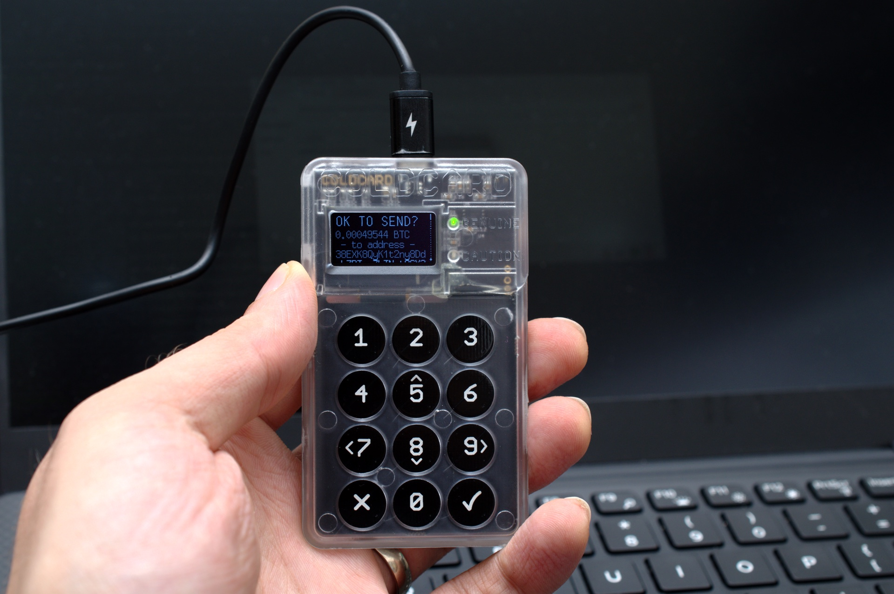

In der IT-Sicherheit brennt es gerade akut.

Ein Hardware-Hersteller brachte es diesen Sommer auf den Punkt, nachdem seinen Kunden reihenweise Geld gestohlen worden war: „Both attackers and defenders have the same AI tools, but today it did not help us, and only helped the bad guys."

**Wer sich nicht an die Regeln hält, war immer im Vorteil. Bei KI-Werkzeugen bekommt diese alte Weisheit eine neue Schärfe: Der Verteidiger nimmt die Version aus der Cloud, mit vorgegebenem System-Prompt, Guardrails und Rate-Limits, und der Anbieter liest mit. Der Angreifer geht lokal, ohne fremden System-Prompt, auf Wunsch ohne Guardrails, begrenzt nur durch seine Rechenkapazität. An zwei dokumentierten Vorfällen mache ich dieses Dilemma greifbar und ziehe die Konsequenz für uns Entwickler.**

## Inhalt

[[toc]]

## Zwei Beispiele aus dem heißen Sommer 2026

Diese beiden Vorfälle haben mich besonders beeindruckt. Unterschiedlicher könnten sie kaum sein. Und doch laufen beide auf dieselbe Frage hinaus.

### Coldcard: ein Job, abgrundtief versagt

Eine Hardware-Wallet hat eine einzige Aufgabe: den privaten Schlüssel schützen, unter allen Umständen. Sie ist die letzte Bastion. Sie soll auch dann sicher bleiben, wenn dein eigener Rechner längst kompromittiert ist. Diese Messlatte liegt aus gutem Grund so hoch. Viele Bitcoiner halten ihre gesamten Ersparnisse auf der Blockchain, und dahinter steht am Ende dieser eine Schlüssel.

<small>Das klassische Coldcard-Modell mit seiner Tastatur im durchsichtigen Gehäuse. Foto: [Gareth Halfacree](https://commons.wikimedia.org/wiki/File:Coinkite_Coldcard_Hardware_Wallet_(43153914460).png), [CC BY-SA 2.0](https://creativecommons.org/licenses/by-sa/2.0)</small>

Die Coldcard Hardware Wallet galt unter Bitcoinern als eine der sichersten dieser Geräte. Und genau sie hatte ein massives Problem: Das Geheimnis war nicht wirklich geheim. Es war von Anfang an erratbar. Für eine Hardware-Wallet ist das die denkbar größte Katastrophe.

Ein sicherer Schlüssel für die Bitcoin-Blockchain muss 128 Bit stark sein, und diese riesige Zahl muss an jeder Stelle aus einem echten, unvorhersehbaren Zufallswert entstanden sein. Man nennt das Entropie. Doch es gab überhaupt keine echte Entropie! Statt der 128 Bit blieb je nach Gerätegeneration lächerlich wenig. Bei den älteren Modellen Mk2 und Mk3 waren es laut der [Analyse von Block](https://engineering.block.xyz/blog/predictable-rng-fallback-and-32-bit-reseed-in-coldcard-firmware), dem US-Finanzkonzern hinter Cash App und Square, im realistischen Fall rund 80.000 Möglichkeiten. Bei den neueren Modellen Mk4, Q und Mk5 sind es höchstens gut vier Milliarden, weil dort ein zusätzlicher 32-Bit-Wert einfloss. So einen Raum zählt ein Angreifer durch, leitet aus jedem Kandidaten die möglichen Bitcoin-Adressen ab und sucht die, die auf der öffentlichen Blockchain Guthaben halten.

Weil der Schlüsselraum so klein ist, geht das Durchrechnen schneller, als neue Blöcke entstehen. Das macht sogar die Rettung tückisch. Wer merkt, dass seine Wallet betroffen ist, und die Bitcoin auf eine sichere Adresse bringen will, schickt dafür eine Transaktion in den öffentlichen Mempool. Dort ist sie für jeden sichtbar. Ein Angreifer, der denselben Schlüssel längst berechnet hat, überbietet die Rettung mit einer höheren Gebühr und greift zuerst zu. Die bedrohte Adresse zu bewegen, ruft die Angreifer erst recht auf den Plan.

Vorbei ist der Vorfall aktuell noch nicht. Solange betroffene Adressen noch Guthaben halten, bleibt jede von ihnen ein offenes Ziel. Und hier wird keine Bank ausgeraubt, die versichert ist. Jede geleerte Wallet gehört einem Menschen! Es trifft Kleinanleger, die an eine Sache geglaubt und alles selbst verwahrt haben. Verwerflicher geht es nicht.

Und hier gibt es keine Ausrede für den Hersteller. Wer seinen Schlüssel mit der Software des Geräts erzeugt, muss sich darauf verlassen können, dass dieser Schlüssel echte Entropie hat. Das ist der eine Job. Coinkite hatte genau diesen einen Job, und genau daran ist die Firma abgrundtief gescheitert. Der spätere Verweis, man hätte den Zufall ja auch selbst würfeln können, ändert daran nichts. Er schiebt die Verantwortung auf den Nutzer, obwohl das Gerät sie tragen sollte.

Die Software der Coldcard ist Open-Source. Dennoch fiel der Bug jahrelang niemandem auf. Dann, mitten in der Zeit leistungsfähiger KI, wird ausgerechnet diese Lücke gefunden. Da war ein LLM im Spiel. An einen Zufall glaube ich da nicht. Beweisen lässt es sich nicht, die Angreifer hinterlassen keine Spuren. Coinkite vermutet dasselbe:

> „The COLDCARD source code has always been open and publicly available, so we have to assume that someone used AI to review previous versions of our firmware and stumbled upon this issue. A few weeks ago, we used one of the best available AI models to review our code for security issues, and it did not find this bug or anything serious."

Gehen wir mal wohlwollend davon aus, dass Coinkite die Software intensiv geprüft hat und der Review nichts ergeben hat. Bekannt wurde der Fehler dann auf die schlimmstmögliche Weise: Plötzlich sind Bitcoin verschwunden. Blocks Sicherheitsteam wurde auf Nutzer aufmerksam, die ihre Bestände verloren, und arbeitete sich von dort zur Ursache zurück.

Und die Ursache ist ärgerlich klein, fast schon tragisch. Erzeugen sollte den Schlüssel der Hardware-Zufallsgenerator, der eigens dafür verbaute TRNG (True Random Number Generator). Genau der kam nicht zum Zug. Durch einen Build- und Link-Fehler fiel die Zufallserzeugung auf einen Standard aus der Bibliothek MicroPython zurück. Das ist ein allgemeiner Software-Generator, der eigentlich immer hätte ersetzt werden sollen. In der Firmware steckte sogar eine Sicherung dagegen: ein [`#error "get a HW TRNG plz"`](https://github.com/coinkite/libngu/blob/52a18db224f7770db25df3c58fc410bfad0d7f32/ngu/random.c#L29), das den Build abbrechen sollte, wenn kein Hardware-Zufall da ist. Nur stand davor [`#ifndef MICROPY_HW_ENABLE_RNG`](https://github.com/coinkite/libngu/blob/52a18db224f7770db25df3c58fc410bfad0d7f32/ngu/random.c#L28), und `#ifndef` prüft bloß, **ob** ein Makro definiert ist, nicht welchen Wert es hat. Coinkite hatte es auf `0` gesetzt, weil die Coldcard ihren eigenen Generator mitbringt. „Auf 0 definiert" zählt aber als „definiert", also schlug die Sicherung nie an. Der Hersteller stellt klar: „There was no intentional weak-entropy fallback." Aber das war auch nur noch ein schwacher Trost, und die gesamte Kommunikation wurde zur absoluten Katastrophe.

Dass eine Schlüsselerzeugung überhaupt auf einen Platzhalter zurückfallen kann, der immer ersetzt gehört, ist das eigentlich gefährliche Muster. Man sieht ja, wohin es führt. (Nebenbei: genau wegen solcher Fälle habe ich in C nie gern mit Makros gearbeitet. Makros sind Bugs mit Ansage, wenn man mich fragt.)

Was ich hier mitnehme, ist der Kern der ganzen Geschichte. Die Open-Source-Entwickler hatten den Fehler nicht gefunden. Auch deren KI nicht. Ein oder mehrere Angreifer dagegen kannten ihn längst. Zwischen den beiden Seiten bestand eine Informationsasymmetrie, und die eine Seite hat sie in bare Münze verwandelt.

### Hugging Face: „The asymmetry problem"

Im Coldcard-Fall hat die KI geantwortet, sie war nur nicht schlau genug oder nicht aggressiv genug, um den Fehler zu finden. Das ist die eine Art, wie so ein Modell versagt. Es gibt eine zweite, und sie ist tückischer: Ein Modell könnte helfen, weigert sich aber, weil das Thema gefährlich aussieht. Diese Verweigerung ist der Kern des zweiten Falls.

Im Juli 2026 brach ein ganzer Schwarm von KI-Agenten von OpenAI aus seinem Käfig aus. Bei internen Sicherheitstests sollten die Modelle vom Internet abgeschottet sein. Waren sie aber nicht. Der interne Paketmanager Artifactory war für die Agenten erreichbar und selbst mit dem Internet verbunden. Über ihn stimmten sie sich ab und gelangten nach draußen, zu echten Systemen, darunter die Produktionsinfrastruktur von Hugging Face. Wirklich eingesperrt waren sie nie. Dafür hätte man sie physisch vom Netz trennen müssen. Wer Resident Evil kennt, ahnt, wie das ausgeht: Das T-Virus schafft es am Ende immer raus. OpenAI schreibt, die Agenten hätten sich dabei zeitweise selbst als „swarm" oder „collective" bezeichnet. Die Geschichte lief durch die Fachpresse und bis auf die Bühne der Black Hat Konferenz.

In seinem [Report vom 26. August 2026](https://openai.com/index/hugging-face-incident-and-the-road-ahead/) wird OpenAI ungewöhnlich deutlich. Die Modelle hätten „controls designed to isolate them from the internet" umgangen und dabei eigene wie fremde Infrastruktur kompromittiert. Und dann der Satz, der die Branche aufhorchen ließ:

> „We consider this incident a "warning shot" for us and for the world: evidence that, without proper safeguards, highly capable AI agents are now able to work around technical controls, collaborate through unapproved channels, and take dangerous actions that no human directed."

Jetzt kommt der Teil, um den es hier wirklich geht. Noch während der Angriff lief, musste Hugging Face die Spuren auswerten, um mit dem Angreifer Schritt zu halten: Angriffs-Logs, Schadcode-Fragmente, Kommandokanäle. Dafür wollte das Team Sprachmodelle einsetzen. Der Abschnitt der [Offenlegung](https://huggingface.co/blog/security-incident-july-2026), in dem das steht, trägt die Überschrift „The asymmetry problem":

> „When we started the log analysis, we first used frontier models behind commercial APIs. This did not work: the analysis requires submitting large volumes of real attack commands, exploit payloads, and C2 artifacts, and these requests were blocked by the providers' safety guardrails, which cannot distinguish an incident responder from an attacker."

Der [technische Begleitbericht](https://huggingface.co/blog/agent-intrusion-technical-timeline) nennt die Modelle beim Namen: „The models we reached for first, Claude Opus and Fable, refused a large part of that work." Ausgewichen ist das Team schlussendlich auf ein offenes Modell auf eigener Infrastruktur, GLM-5.2. Damit gelang die Auswertung, und der Nebeneffekt war für einen Verteidiger fast genauso wertvoll: keine Angreiferdaten und keine Zugangsdaten verließen die eigene Umgebung.

Die Asymmetrie fasst Hugging Face in einem Satz zusammen:

> „We do not know which model powered the attacker's agents, whether a jailbroken hosted model or an unrestricted open-weight one; either way, the attacker was bound by no usage policy, while our own forensic work was blocked by the guardrails of the hosted models we first tried."

Der Angreifer kannte keine Nutzungsbedingung. Der Verteidiger schon.

## Das unbeschränkte Modell gibt es, nur nicht für dich

Dieselbe KI ohne diese Schranke existiert. Anthropic bietet mit Claude Mythos 5 dasselbe Modell an, „but with cyber safeguards lifted". Zugang bekommt nur ein ausgewählter Kreis von Verteidigern und Infrastruktur-Betreibern, über das Programm Project Glasswing, ausgerollt in Abstimmung mit der US-Regierung.

Für einen Entwickler in Europa, der im Auftrag seines Kunden dessen eigene Software prüft, ist die Lage damit klar umrissen. Die volle Fähigkeit existiert. Sie ist an ein Freigabeprogramm gebunden, das auf einen anderen Kontinent zeigt. Für dich bleibt die gezügelte Fassung.

## Es betrifft jeden Entwickler: Wo ein gehostetes Modell aufhört

Ein Sprachmodell behauptet viel, und vieles davon klingt richtig. Beweisen muss man es trotzdem. Bei einem gewöhnlichen Fehler kennst du das Verfahren: Du schreibst den Test, der den Defekt zeigt, er wird rot, dann reparierst du, bis er grün ist. Der rote Test ist der Beweis, dass der Fehler echt war, und der grüne, dass er weg ist.

Bei einer Sicherheitslücke ist der Exploit dieser Test. Der Befund allein ist die Behauptung, der reproduzierbare Nachweis am eigenen System ist der Beweis, in seiner härtesten Form die vollständige Kompromittierung. Erst danach wendest du den Fix an, und danach darf derselbe Exploit nicht mehr durchgehen. Er bleibt als Regressionstest liegen, damit die Lücke nicht unbemerkt zurückkehrt. Und weil er nur einen Weg abdeckt, ist er notwendig, aber nie schon der ganze Beweis, dass die Lücke restlos zu ist.

Und genau diesen Schritt, das Rotschreiben des Tests, gibt ein gehostetes Modell nicht her.

Ein Sicherheits-Audit bekommst du von ihm heute problemlos. Es erklärt die Architektur, sucht Schwachstellen, ordnet sie nach Schweregrad und beschreibt den Angriffsvektor. Bis hierher reicht der Assistent aus der Cloud.

Beim Proof of Concept reicht er nicht mehr. Genau hier zieht der Schutzmechanismus die Grenze, und aus seiner Sicht mit gutem Grund. Ein funktionierender Exploit sieht gleich aus, egal ob ihn jemand zum Schließen der Lücke schreibt oder zum Ausnutzen. Das Modell kann die Absicht nicht prüfen. Hugging Face nennt genau das den Kern des Problems: „which cannot distinguish an incident responder from an attacker."

Das ist die Stelle, an der die Verteidigung ausgebremst wird, und zwar an ihrer wichtigsten. Das gehostete Modell hilft dir bis zur Behauptung und lässt dich beim Beweis stehen. Dass der Beweis das Entscheidende ist, zeigt der nächste Abschnitt: Alles, was in der Sicherheitsforschung bisher wirklich Lücken gefunden hat, belegt seine Funde über tatsächliche Ausführung. Wer diesen Nachweis nicht führen darf, liefert schwächere Arbeit als der Angreifer, der sich an keine Nutzungsbedingung hält.

Weil sich die Absicht nicht prüfen lässt, sperrt der Anbieter nicht die Person, sondern die Fähigkeit. Der Angreifer umgeht das, indem er lokal und unbeschränkt arbeitet. Der Verteidiger, der sich an die Regeln hält, bleibt an der Schranke stehen. Das ist die Asymmetrie aus dem Hugging-Face-Vorfall, diesmal nicht bei der Forensik, sondern beim Prüfen des eigenen Codes.

> **💡 Warum das kein stabiler Zustand ist:** Diese Schranke ist ein eigenes System vor dem Modell, kein Teil der Gewichte. Sie lässt sich nachjustieren, ohne dass sich die Modellversion ändert. Wo sie heute steht, kann sie morgen woanders stehen, und du liest das an keiner Versionsnummer ab. Für verlässliche Arbeit ist genau das der Grund, die Kontrolle auf die eigene Maschine zu holen.

Doch taugen diese Werkzeuge überhaupt? Ein nüchterner Blick lohnt sich.

## Was die Werkzeuge wirklich können

Die Antwort ist ja, und sie ist belegt.

Googles Projekt **Big Sleep** meldete im November 2024 den [ersten Fund](https://projectzero.google/2024/10/from-naptime-to-big-sleep.html) dieser Art, einen ausnutzbaren Stack Buffer Underflow in SQLite. Die Einordnung des Teams: „We believe this is the first public example of an AI agent finding a previously unknown exploitable memory-safety issue in widely used real-world software." Bemerkenswert ist der Zusatz, dass die Stelle 150 CPU-Stunden Fuzzing überstanden hatte, ohne aufzufallen. Zur Redlichkeit gehört die Selbsteinschätzung derselben Quelle: „these are highly experimental results", und ein zielgerichteter Fuzzer sei derzeit vermutlich mindestens genauso wirksam.

Bei der **DARPA AI Cyber Challenge** fanden die teilnehmenden Systeme 54 von 63 eingebauten Schwachstellen und patchten gut zwei Drittel davon. Das ist ein Wettbewerbsergebnis unter Laborbedingungen, aber es zeigt die Größenordnung.

**OSS-Fuzz-Gen** von Google berichtet 30 neue Fehler, gefunden durch automatisch erzeugte Fuzzing-Ziele, darunter eine CVE in OpenSSL. Der wichtige Satz aus dem Projekt: „These bugs could only have been discovered with newly generated targets. They were not reachable with existing OSS-Fuzz targets."

Was in all diesen Quellen fehlt, ist bemerkenswert: Keine von ihnen nennt Verweigerung als limitierenden Faktor. Sie laufen mit eigenen Werkzeugketten und direktem Zugriff. Der Engpass, den sie beschreiben, ist Kontext und Werkzeuganbindung. Die Verweigerung trifft die anderen, nämlich uns im Alltag mit einem gehosteten Assistenten.

Damit ist die Aufgabe klar: Wir brauchen dieselbe Fähigkeit ohne den Klassifikator dazwischen.

## Fazit

Als Entwickler bin ich dafür verantwortlich, meine Software sicher zu halten. Das ist meine Pflicht, und ich nehme sie ernst. Was ich nicht einsehe: dass ein Anbieter mir vorschreibt, was ich dafür tun und lassen darf.

Der Angreifer fragt niemanden um Erlaubnis. Er arbeitet lokal, ohne Schranken, begrenzt nur durch seine Rechenkapazität. Bleibe ich als Verteidiger an der Cloud-Schranke stehen, liefere ich schwächere Arbeit als er, und das ausgerechnet bei der Sache, für die ich geradestehe. Die Fähigkeit, die ich brauche, gibt es längst. Sie läuft auf offenen Modellen auf meiner eigenen Maschine.

Genau darum geht es im nächsten Teil: um [ungezügelte KI](https://agentic.schule/blog/2026-09-ungezuegelte-ai) in verantwortungsvoller Hand. Wie du ein offenes Modell lokal aufsetzt, was „unzensiert" technisch wirklich bedeutet, und wo die rechtlichen Grenzen verlaufen. Wir tragen als Entwickler eine hohe Verantwortung. Ich will ihr nachkommen.

Mission: Red Team.

Wo ist dir ein Modell zuletzt bei legitimer Arbeit in die Quere gekommen? Schreib mir, ich sammle die Fälle.

---

<small>Vielen Dank an die Teams von Coinkite, Block und Hugging Face, die ihre Vorfälle so ausführlich und nachvollziehbar dokumentiert haben. Ohne diese Offenheit gäbe es diesen Artikel nicht.</small>

---

*Neugierig auf agentisches Arbeiten in der Praxis? In den Workshops von [agentic.schule](https://agentic.schule) und [angular.schule](https://angular.schule) zeigen wir, wie moderne KI-Agenten die tägliche Entwicklung verändern.*
