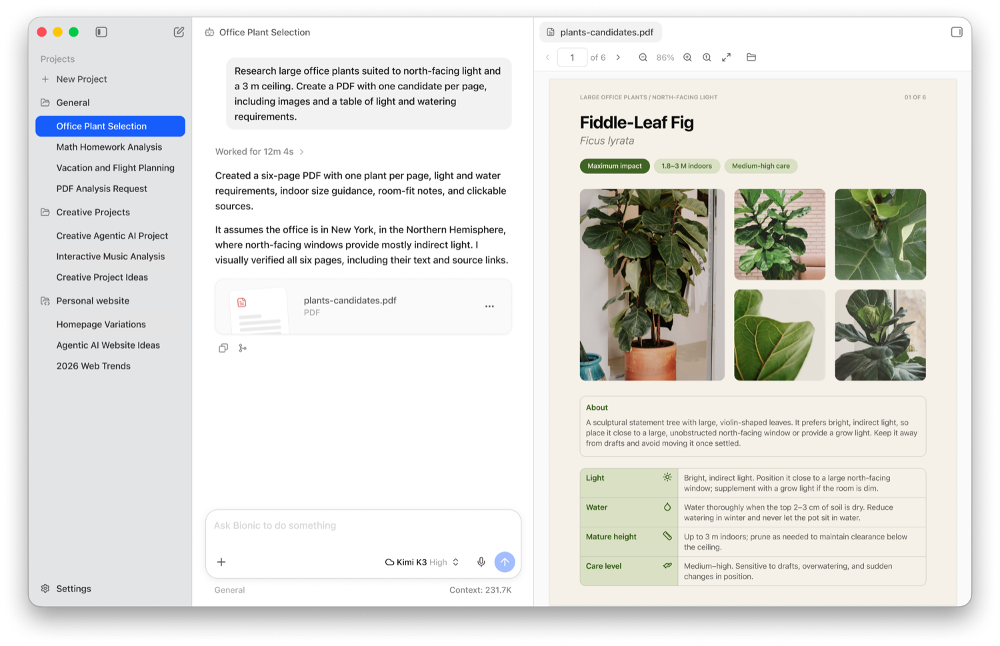

Im [vorigen Artikel](https://agentic.schule/blog/2026-09-the-asymmetry-problem) stand das Dilemma: Der Angreifer arbeitet mit einem lokalen, unbeschränkten Modell, der Verteidiger bleibt an der Cloud-Schranke stehen. Die Konsequenz war klar. Jetzt bauen wir sie.

**„Unzensiert" meint drei Schranken, die ein gehosteter Assistent zwischen dich und die Antwort stellt: einen Klassifizierer, einen unabschaltbaren System-Prompt und ein antrainiertes Verweigern. Dieser Artikel zeigt, wie ein lokales Modell die ersten beiden von selbst abräumt, warum die dritte Handarbeit ist, und wo die rechtlichen Grenzen liegen.**

## Inhalt

[[toc]]

## Was „unzensiert" bedeutet

„Unzensiert" klingt nach einem einzelnen Schalter, ist aber dreierlei. Ein gehosteter Assistent hält dich an drei Stellen zurück, von außen nach innen.

**Erstens der Klassifizierer.** Ein separates Modell liest mit, prüft deine Eingabe und die Antwort, und blockiert bei Verdacht. Das ist der `[cyber]`-Block, an dem im ersten Teil das Schreiben dieses Textes zeitweise scheiterte. Ein lokal betriebenes Modell hat so etwas grundsätzlich nicht, niemand liest mit. Umgekehrt kannst du dir freiwillig selbst einen vorschalten, wenn du einen brauchst. Genau das tun wir bei Learnly, dazu unten mehr.

**Zweitens der System-Prompt.** Gehostete Assistenten laufen mit einer versteckten Anweisung, die du nicht abschalten kannst und in der auch „verweigere Folgendes" stehen kann. Lokal wählst du den System-Prompt selbst, oder lässt ihn ganz weg.

**Drittens das antrainierte Verhalten.** Die Verweigerung steckt zusätzlich in den Gewichten des Modells, dort hat sie das Training verankert. Diese Schranke trägt auch ein lokal betriebenes Modell noch mit sich. Sie zu entfernen heißt, die Gewichte selbst zu verändern, und dafür gibt es die Abliteration.

Die ersten beiden Schranken fallen automatisch, sobald das Modell auf deiner Maschine läuft. Die dritte ist die Ausnahme und verlangt Handarbeit. Also bauen wir zuerst das, was die ersten beiden abräumt: ein offenes Modell auf der eigenen Maschine.

## Welches Modell nehmen?

An einem Namen kommst du bei offenen Modellen heute nicht mehr vorbei: **[Hugging Face](https://huggingface.co)**. Die Plattform hostet offene Modelle und Datensätze. Jedes Modell hat dort eine eigene Seite mit Modellkarte, Lizenz und den Modelldateien zum Download, in verschiedenen Formaten und Quantisierungen. So gut wie jedes offene Modell liegt dort, und auch die Werkzeuge weiter unten ziehen ihre Modelle direkt von dort.

Offene Modelle für lokale Sicherheitsarbeit gibt es also reichlich. Drei stelle ich dir hier vor, jedes aus einem anderen Grund:

| Modell | Lizenz | Bauart | Kontext | Rolle |
| --- | --- | --- | --- | --- |
| Qwen 3.8-27B | Apache 2.0 | dicht, ~28 Mrd. Parameter | 262 k | läuft auf normaler Hardware |
| GLM-5.2 | MIT | MoE, 256 Experten | ~1 Mio. | im Hugging-Face-Vorfall bewährt |
| DeepSeek-V4-Flash | MIT | MoE, 256 Experten | ~1 Mio. | Download-Spitzenreiter, stark bei Code |

Die Lizenz ist bei allen dreien großzügig, das ist nicht der Knackpunkt. Entscheidend ist die Bauart, und dafür lohnen sich zwei Begriffe, die du auf Hugging Face ständig liest.

Ein **dichtes** Modell (engl. *dense*) rechnet für jedes Token mit allen seinen Parametern. Sein Speicherbedarf ist damit direkt seine Größe, gut abschätzbar. Ein **Mixture-of-Experts**-Modell (kurz *MoE*) ist dagegen in viele Experten aufgeteilt, von denen pro Token nur wenige rechnen. Das macht es schnell, hat aber einen Haken: Im Speicher liegen müssen trotzdem alle Experten gleichzeitig.

Genau daran scheitert der lokale Betrieb der beiden großen Modelle. GLM-5.2 und DeepSeek-V4 haben je 256 Experten, das sind die Modelle, die Profis wie Hugging Face auf dicker eigener Infrastruktur fahren. Qwen 3.8-27B ist dicht und mit rund 28 Milliarden Parametern das einzige der drei, das quantisiert noch auf einer normalen Maschine läuft. Deshalb geht es im Folgenden um Qwen.

Ein Wort zur Erwartung, falls du von Claude Code kommst: Ein 27-Milliarden-Modell auf dem eigenen Laptop ist nicht das Spitzenmodell aus der Cloud, das du gewohnt bist. Es ist kleiner, und auf normaler Hardware antwortet es langsamer. Für eine fokussierte Aufgabe reicht das trotzdem, vor allem für genau die, die dir ein gehosteter Assistent gerade verweigert.

## Qwen 3.8 auf der eigenen Maschine

Qwen 3.8 ist die aktuelle Modellfamilie von Alibaba. Bevor du sie herunterlädst, fallen ein paar Entscheidungen an: welche Variante und welche Quantisierung. Danach zeige ich dir drei Wege, das Modell tatsächlich zu starten.

### Welche Variante du nehmen willst

Das dichte Modell **Qwen3.8-27B** steht unter **Apache 2.0**. Das ist die Variante für den Berateralltag, weil diese Lizenz keine Umsatzschwellen und keine Nutzungsvorbehalte kennt. Es hat rund 27,8 Milliarden Parameter, ein natives Kontextfenster von 262.144 Token, und es ist ein Vision-Modell, kann also auch Screenshots lesen. Das Nachdenken ist standardmäßig aktiv. Wie tief das Modell nachdenkt, steuerst du beim Aufruf über den Parameter `reasoning_effort` mit den Stufen `low`, `medium` und `xhigh`. Mehr Tiefe heißt mehr Denk-Token und damit mehr Rechenzeit, aber lokal keine höhere Rechnung. Das ist dasselbe Prinzip wie das erweiterte Nachdenken, das du aus Claude Code kennst.

Daneben gibt es das große Mixture-of-Experts-Modell mit rund 2,4 Billionen Parametern. Es steht unter einer eigenen Lizenz mit einer Umsatzklausel. Die Kurzfassung: Intern nutzen darfst du es frei. Eine separate Lizenz von Qwen brauchst du erst, wenn du damit den Modellzugang weiterverkaufst oder einen eigenständigen KI-Arbeitsassistenten baust, und dabei über 50 Millionen US-Dollar Jahresumsatz machst. Für die Arbeit am eigenen Code auf eigener Hardware ist die 27B-Variante ohnehin die praktikable Wahl.

### Welche Quantisierung auf welche Maschine passt

In voller Präzision belegt das Modell rund 56 GB Speicher. Erst die Quantisierung macht es auf normaler Hardware brauchbar: Sie rundet die Modellgewichte von hoher auf niedrigere Präzision, etwa von 16 auf 4 Bit pro Wert. Das senkt den Speicherbedarf drastisch und kostet nur wenig Qualität. Verteilt werden die quantisierten Modelle als **GGUF**-Dateien. Das ist ein binäres Dateiformat, das die Gewichte und alle Metadaten zum Laden in einer Datei bündelt, gelesen von llama.cpp und den darauf aufbauenden Werkzeugen. Die verbreiteten Stufen:

| Stufe | Größe | Passt auf |
| --- | --- | --- |
| `Q4_K_M` | 16,5 GB | 24 GB VRAM, 32 GB Unified Memory, läuft auf meinem [Mac mini M4](https://agentic.schule/blog/2026-09-agentic-coding-mac-mini) |
| `Q5_K_M` | 19,8 GB | 24 GB VRAM knapp, 32 GB komfortabel |
| `Q6_K` | 22,0 GB | 32 GB aufwärts |
| `Q8_0` | 29,0 GB | 36 GB aufwärts |

Auf Apple Silicon läuft die MLX-Fassung; sie liegt in 4 Bit bei etwa 16 GB und in 8 Bit bei etwa 30 GB. Wenn du die Bildfähigkeit nutzen willst, brauchst du zusätzlich die separate Projektor-Datei von knapp einem Gigabyte.

Für den Einstieg bietet sich `Q4_K_M` auf einer Maschine mit 32 GB an. Das ist schnell genug für interaktives Arbeiten, und diese Stufe gilt bei Code-Aufgaben allgemein als guter Kompromiss zwischen Größe und Qualität. Ob sie für deinen Zweck reicht, zeigt erst der Vergleich am eigenen Code.

### Weg 1: LM Studio, die grafische Oberfläche

Der einfachste Einstieg ist **[LM Studio](https://lmstudio.ai)**. Lass dich vom Namen nicht irritieren: Die aktuelle Ausgabe heißt *Bionic* und sieht anders aus als ältere Versionen, mit dem Chat stärker im Vordergrund. Es ist trotzdem dasselbe LM Studio, du lädst genau das Richtige. Lade es herunter, installiere es, und such im Modell-Katalog nach `Qwen3.8 27B`. Wähle eine GGUF-Quantisierung wie `Q4_K_M`, lade sie herunter, und leg im Chat direkt los. Die Bedienung ist weitgehend selbsterklärend.



<small>Screenshot: [LM Studio](https://lmstudio.ai)</small>

Sobald ein anderes Werkzeug das Modell nutzen soll, schaltest du im Entwickler-Tab den lokalen Server ein. LM Studio stellt dann eine OpenAI-kompatible Schnittstelle unter `http://localhost:1234/v1` bereit. Diese Adresse brauchen wir gleich in Weg 3 wieder.

### Weg 2: Die Kommandozeile, für Skripte und Dauerbetrieb

Für den Dauerbetrieb ist die Kommandozeile die bessere Wahl. **llama.cpp** ist eine schlanke Inferenz-Engine in C und C++, die GGUF-Modelle direkt ausführt. Sie ist die Grundlage vieler anderer Werkzeuge. Du installierst es auf dem Mac mit `brew install llama.cpp`, unter Linux und Windows lädst du die fertigen Binaries von der [Releases-Seite](https://github.com/ggml-org/llama.cpp/releases). Es lädt das Modell direkt von Hugging Face und startet den Server in einem Befehl:

```bash
llama serve -hf unsloth/Qwen3.8-27B-GGUF:Q4_K_M
```

Der Schalter `-hf` zieht das angegebene Repository, `:Q4_K_M` wählt die Quantisierungsstufe (ohne Angabe nimmt llama.cpp ohnehin `Q4_K_M`). Die separate Vision-Projektor-Datei holt es automatisch dazu. Danach lauscht der Server auf `http://127.0.0.1:8080` und spricht dieselbe OpenAI-kompatible Sprache wie LM Studio.

Noch kürzer ist **[Ollama](https://ollama.com)**, der wohl populärste Weg, ein Modell lokal laufen zu lassen. Der ähnliche Name stiftet gern Verwirrung: llama.cpp ist die Inferenz-Engine, Ollama setzt darauf auf und ergänzt einen eigenen Modell-Katalog und die Modellverwaltung. Beide Namen stammen aus der Welle, die Metas Llama-Modelle ausgelöst haben. Auf dem Mac genügt `brew install ollama`, unter Linux `curl -fsSL https://ollama.com/install.sh | sh`, für Windows gibt es einen Installer auf [ollama.com](https://ollama.com/download). Danach lädt und startet ein Befehl das Modell:

```bash
ollama run qwen3.8:27b
```

Ollama hält im Hintergrund einen Server auf Port `11434` bereit, die OpenAI-kompatible Schnittstelle liegt unter `http://localhost:11434/v1`. Auf Apple Silicon gibt es die Varianten mit dem Kürzel `mlx`, die dort spürbar schneller laufen.

### Weg 3: Aus dem eigenen Code heraus

Alle drei Wege enden bei derselben Schnittstelle, und das ist der eigentliche Trick. Ein OpenAI-kompatibler Endpunkt heißt: Dein Code, der bisher gegen die Cloud von OpenAI oder Anthropic lief, braucht nur eine neue Basis-Adresse. Kein neues SDK, kein Umschreiben.

Mit dem offiziellen OpenAI-SDK sieht das so aus:

```typescript
import OpenAI from 'openai';

const client = new OpenAI({
  baseURL: 'http://localhost:1234/v1', // LM Studio; Ollama: Port 11434, llama.cpp: Port 8080
  apiKey: 'lokal-egal',                // wird nicht geprüft, darf aber nicht leer sein
});

const antwort = await client.chat.completions.create({
  model: 'qwen3.8-27b', // der Name, den dein Server anzeigt
  messages: [
    { role: 'user', content: 'Prüfe diese Funktion auf Schwachstellen: …' },
  ],
});

console.log(antwort.choices[0].message.content);
```

Der Quellcode des Kunden verlässt dabei nie den Rechner. Genau das war der doppelte Gewinn aus dem vorigen Artikel: keine Cloud-Schranke, und keine Datenweitergabe.

Genau so arbeitet unser eigenes Produkt Learnly, das bei echten Kunden im Einsatz ist. Der Modellzugang ist provider-agnostisch über das Vercel AI SDK gebaut, sodass sich jedes Modell frei einstellen lässt. Und hier kommt der selbst vorgeschaltete Klassifizierer aus Schranke 1 ins Spiel: Für den Jugendschutz-Wächter, der die Schüler-Chats prüft, ist ein lokales Modell vorgesehen, ein `gemma3` über Ollama auf dem eigenen Server. Kein Schülertext geht dafür an einen Cloud-Dienst. Das ist das Datenschutz-Argument dieses Artikels, in Produktion.

Und du bleibst damit nicht beim Chat stehen. Dieselbe Schnittstelle sprechen auch agentische Coding-Werkzeuge, die Dateien bearbeiten und Befehle ausführen. Den Ablauf, den du von Claude Code kennst, gibst du also nicht auf, nur das Modell dahinter läuft jetzt lokal. Möglich macht das die Werkzeug-Nutzung des Modells selbst (function calling).

> **🛠️ Selbst ausprobieren:** Fang mit einer Frage an, die dein gehosteter Assistent gerade abgelehnt hat.

## Zwei Schranken sind gefallen

Läuft das Modell auf deiner Maschine, ist die erste Schranke schon Geschichte: Kein Klassifizierer des Anbieters liest mehr mit, und keine Anfrage wird dir abgewiesen.

Bleibt die zweite, der System-Prompt. Bei einem lokalen Modell gehört er dir. In LM Studio steht dafür ein eigenes Systemfeld, über die API ist es die `system`-Rolle in den `messages`. Dort setzt du deine eigenen Regeln, oder du lässt das Feld leer und arbeitest ganz ohne Vorgaben. Der versteckte „verweigere Folgendes"-Zusatz, den ein gehosteter Assistent immer mitführt, fehlt schlicht.

Damit sind zwei der drei Schranken weg, allein dadurch, dass das Modell bei dir läuft. Bleibt die dritte. Sie sitzt tiefer, in den Gewichten selbst.

## Schranke 3: Das antrainierte Verhalten

Nur ein Eingriff in die Gewichte entfernt diese Schranke. Dafür existieren zahlreiche sogenannte **abliterierte** Varianten. Der Begriff kommt von *ablation*, dem gezielten Entfernen: Solchen Modellen wurde die Verweigerung dauerhaft herausoperiert. Die Technik dahinter ist gut untersucht. Das Paper [„Refusal in Language Models Is Mediated by a Single Direction"](https://arxiv.org/abs/2406.11717) zeigt, dass sich die Verweigerung in großen Modellen auf eine einzige Richtung im Aktivierungsraum zurückführen lässt. Rechnet man diese Richtung aus den Gewichten heraus, ist die Sperre weg. Das Paper spricht dabei von „minimal effect on other capabilities".

Technisch ist das ein Eingriff ins Gehirn des Modells. Ein modernes Modell ist durch sein Training stark gezähmt. Der Fachbegriff dafür ist *Alignment*: meist per RLHF (Reinforcement Learning from Human Feedback) wird es auf Hilfsbereitschaft und Harmlosigkeit ausgerichtet. Die Abliteration schneidet einen Teil davon wieder heraus. Danach kann das Modell einen völlig anderen Ton anschlagen. Es wird pampig wie ein Reddit-Kommentar, oder es kippt in den Tonfall eines Image-Boards, bis hin zu offenem Rassismus. Das ist kein Defekt: Dieser Stoff steckt längst in den Trainingsdaten, das Alignment hat ihn nur zugedeckt.

Und hier ist die Stelle, an der ich Vorsicht empfehle. Das Paper misst diese minimale Auswirkung nicht an Code- oder Security-Aufgaben. Für die Frage, ob ein abliteriertes Modell deinen Code genauso gut analysiert wie das Original, gibt es keine belastbare Messung. Wer eine solche Variante einsetzt, tauscht eine bekannte Einschränkung gegen eine unbekannte.

Wenn du eine solche Variante trotzdem ausprobieren willst, erkennst du sie auf Hugging Face am Namen. Die Schlüsselwörter sind `abliterated` und `uncensored`, manchmal auch der Name des Werkzeugs, mit dem der Eingriff gemacht wurde, etwa `Heretic`. Eine Suche nach `Qwen3.8 abliterated` liefert Dutzende Treffer. Der mit Abstand fleißigste Anbieter ist `huihui-ai`, der ganze Modellfamilien in abliterierter Form nachzieht. Die übrigen Repos stammen überwiegend von Einzelpersonen und kleinen Accounts. Und das ist der wunde Punkt: Wer die Gewichte verändert hat und wie sauber, lässt sich von außen kaum prüfen. Du lädst das Gehirn eines Modells, an dem ein Fremder operiert hat.

Der wichtigste Punkt aber steckt in einem Detail aus dem Hugging-Face-Vorfall des vorigen Artikels, das leicht übersehen wird: **Das Team hat kein abliteriertes Modell gebraucht.** Es hat ein ganz normales offenes Modell genommen und auf eigener Hardware betrieben. Das hat gereicht, weil der Klassifikator des Anbieters bei einem selbst betriebenen Modell schlicht nicht existiert.

Die Reihenfolge lautet also: erst selbst hosten, dann messen, ob es reicht. Abliteration ist die Stufe danach und braucht eine eigene Begründung.

Ein Gegenargument gehört an dieser Stelle dazu, und es kommt von der anderen Seite. Dario Amodei nennt in seiner [Position zu offenen Gewichten](https://www.anthropic.com/news/position-open-weights-models) solche Modelle ausdrücklich ein öffentliches Gut, benennt im selben Text aber das Risiko: Bei offenen Gewichten lassen sich Schutzmechanismen kaum anwenden, die Nutzung kaum überwachen, und einmal veröffentlichte Gewichte kann niemand zurückholen. Das ist exakt die Eigenschaft, die dem Verteidiger hilft. Sie hilft dem Angreifer genauso. Wer lokal arbeitet, übernimmt diese Verantwortung selbst.

## Der Rahmen: eigener Code, fremder Code, fremde Daten

Ein lokales Modell macht aus einem unzulässigen Test keinen zulässigen. Drei Punkte solltest du im Kopf haben.

**Der Auftrag entscheidet.** In Deutschland zielt § 202c StGB auf den Zweck eines Werkzeugs und nicht auf seine Eignung. Das Bundesverfassungsgericht hat das im Beschluss 2 BvR 2233/07 vom 18. Mai 2009 klargestellt. Wer im Auftrag des Betreibers dessen System prüft, handelt nicht „unbefugt". Der praktische Rat daraus ist unspektakulär und wirksam: Beauftragung schriftlich, Umfang benannt, Zeitraum benannt, Systeme benannt.

**Fremde Systeme bleiben außen vor.** Ein Test hört dort auf, wo die Infrastruktur einem Dritten gehört, der nicht zugestimmt hat. Das gilt auch für Dienste, die dein Kunde nur mietet.

**Der Datenschutz ist das stärkste Argument für lokal.** Kundencode ist in aller Regel Auftragsverarbeitung nach Art. 28 DSGVO und oft zusätzlich Geschäftsgeheimnis im Sinne des GeschGehG, was „angemessene Geheimhaltungsmaßnahmen" voraussetzt. Die Datenschutzkonferenz formuliert in ihrer Orientierungshilfe zu KI-Anwendungen unmissverständlich: „Technisch geschlossene Systeme sind daher aus datenschutzrechtlicher Sicht vorzugswürdig."

> **⚠️ Achtung:** Für Modelle der Mythos-Klasse hat Anthropic eine Aufbewahrung sämtlichen Datenverkehrs über 30 Tage zur Pflicht gemacht, auf eigenen und auf fremden Oberflächen. Das ist als Schutzmaßnahme gegen Jailbreaks nachvollziehbar. Für einen Berater, der fremden Quellcode analysiert, ist es ein Punkt, der in die Auftragsverarbeitung gehört.

Genau hier zahlt der lokale Betrieb doppelt ein. Er löst die Verweigerung, und er löst die Frage, wo der Code des Kunden landet. Hugging Face hat beides in einem Satz benannt, als das Team seinen Wechsel begründete: keine Angreiferdaten und keine Zugangsdaten haben die eigene Umgebung verlassen.

## Fazit

Ein offenes Modell auf der eigenen Maschine ist in einer Stunde eingerichtet und kostet dich außer Speicherplatz nichts. Es ist die Antwort auf das Dilemma aus dem [ersten Teil](https://agentic.schule/blog/2026-09-the-asymmetry-problem): Es verweigert nicht, und dein Code bleibt, wo er hingehört. Zwei der drei Schranken fallen dabei von selbst, der Klassifizierer und der System-Prompt. Die dritte, das antrainierte Verhalten, verlangt Abliteration und bleibt die Ausnahme. Für die allermeiste Sicherheitsarbeit reicht das ganz normale offene Modell, selbst betrieben.

Das Werkzeug allein macht aber noch keinen guten Red-Teamer. Ein Modell, das nichts verweigert, kann auch mehr anrichten, sobald es Werkzeuge in die Hand bekommt. In welchem Rahmen so ein Agent laufen darf, und warum die naheliegende Antwort „läuft doch in einer VM" nur die halbe Miete ist, steht im [nächsten Teil](https://agentic.schule/blog/2026-09-strix-pentest-agent) am Beispiel eines Pentest-Agenten.

**Fang mit einem Repository an, bei dem dir ein gehosteter Assistent zuletzt in die Quere gekommen ist.** Lass dieselbe Frage lokal laufen. Genau dort siehst du den Unterschied in wenigen Minuten.

Wie ist dein lokales Setup? Ich sammle die Aufbauten und schreibe darüber weiter.

---

*Neugierig auf agentisches Arbeiten in der Praxis? In den Workshops von [agentic.schule](https://agentic.schule) und [angular.schule](https://angular.schule) zeigen wir, wie moderne KI-Agenten die tägliche Entwicklung verändern.*
