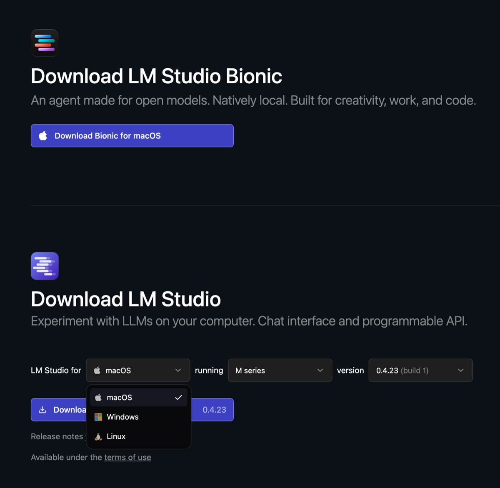
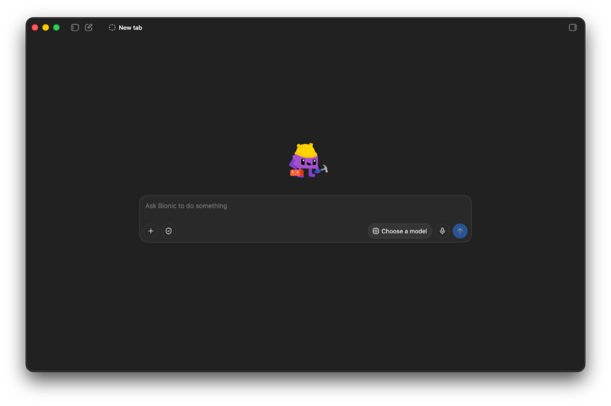

Im [vorigen Artikel](https://agentic.schule/blog/2026-09-the-asymmetry-problem) habe ich folgendes Dilemma aufgezeigt: Der Angreifer arbeitet mit einem lokalen, unbeschränkten Modell und kennt keine Grenzen. Der Verteidiger dagegen sitzt bei einem Cloud-Anbieter fest, dessen Modell bei heiklen Sicherheitsthemen abblockt. Die Konsequenz daraus ist einfach: Der Verteidiger muss sich dieselbe Freiheit zurückholen, ein offenes Modell auf der eigenen Maschine, das nicht abblockt und den Code nicht aus der Hand gibt.

**Genau das bauen wir jetzt. Ein gehosteter Assistent stellt gleich mehrere Schranken zwischen dich und die Antwort. Drei davon nimmt sich dieser Artikel vor: einen Klassifizierer, einen unabschaltbaren System-Prompt und ein antrainiertes Verweigern. Er zeigt, wie ein lokales Modell die ersten beiden von selbst abräumt, warum die dritte Handarbeit ist, und wo die rechtlichen Grenzen liegen.**

## Inhalt

[[toc]]

## Was „unzensiert" bedeutet

„Unzensiert" klingt nach einem einzelnen Schalter, ist aber vielschichtig. Ein gehosteter Assistent hält dich an mindestens folgenden drei Stellen zurück, von außen nach innen.

**Erstens der Klassifizierer.** Ein separates Modell liest mit, prüft deine Eingabe und die Antwort, und blockiert bei Verdacht. Das ist der `[cyber]`-Block, an dem ich im ersten Teil beim Schreiben dieses Textes zeitweise scheiterte. Ein lokal betriebenes Modell hat so etwas grundsätzlich nicht, niemand liest mit. Umgekehrt kannst du dir freiwillig selbst einen vorschalten, wenn du einen brauchst. Genau das tun wir bei Learnly, dazu unten mehr.

**Zweitens der System-Prompt.** Gehostete Assistenten laufen mit einer festen Anweisung, die du nicht ändern kannst und die dem Modell auch vorschreibt, was es ablehnen soll. Die Community hat die Prompts der großen Anbieter längst extrahiert, in [dieser Sammlung](https://github.com/asgeirtj/system_prompts_leaks) kannst du die Benimmregeln der Modelle genau nachlesen. Lokal wählst du den System-Prompt dagegen selbst, oder lässt ihn ganz weg.

**Drittens das antrainierte Verhalten.** Die Verweigerung steckt zusätzlich in den Gewichten des Modells, dort hat sie das Training verankert. Diese Schranke trägt auch ein lokal betriebenes Modell noch mit sich. Sie zu entfernen heißt, die Gewichte selbst zu verändern, und dafür gibt es die Abliteration.

Die ersten beiden Schranken fallen automatisch, sobald das Modell auf deiner Maschine läuft. Die dritte ist die Ausnahme und verlangt Handarbeit. Also bauen wir zuerst das, was die ersten beiden abräumt: ein offenes Modell auf der eigenen Maschine.

## Welches Modell nehmen?

An einem Namen kommst du bei offenen Modellen heute nicht mehr vorbei: **[Hugging Face](https://huggingface.co)**. Die Plattform hostet offene Modelle und Datensätze. Jedes Modell hat dort eine eigene Seite mit Modellkarte, Lizenz und den Modelldateien zum Download, in verschiedenen Formaten und Quantisierungen. So gut wie jedes offene Modell liegt dort, und auch die Werkzeuge weiter unten ziehen ihre Modelle meist direkt von dort.

Offene Modelle für lokale Sicherheitsarbeit gibt es also reichlich. Drei stelle ich dir hier vor, jedes aus einem anderen Grund:

| Modell | Lizenz | Bauart | Kontext | Rolle |
| --- | --- | --- | --- | --- |
| Qwen 3.8-27B | Apache 2.0 | dicht, ~28 Mrd. Parameter | 262 k | läuft auf normaler Hardware |
| GLM-5.2 | MIT | MoE, 256 Experten | ~1 Mio. | im Hugging-Face-Vorfall bewährt |
| DeepSeek-V4-Flash | MIT | MoE, 256 Experten | ~1 Mio. | Download-Spitzenreiter, stark bei Code |

Die Lizenz ist bei allen dreien großzügig, das ist nicht der Knackpunkt. Entscheidend ist die Bauart, und dafür lohnen sich zwei Begriffe, die du auf Hugging Face ständig liest.

Ein **dichtes** Modell (engl. *dense*) rechnet für jedes Token mit allen seinen Parametern. Sein Speicherbedarf ist damit direkt seine Größe, gut abschätzbar. Ein **Mixture-of-Experts**-Modell (kurz *MoE*) ist dagegen in viele Experten aufgeteilt, von denen pro Token nur wenige rechnen. Das macht es schnell, hat aber einen Haken: Im Speicher liegen müssen trotzdem alle Experten gleichzeitig.

Genau daran scheitert der lokale Betrieb der beiden großen Modelle. GLM-5.2 und DeepSeek-V4 haben je 256 Experten, das sind die Modelle, die Profis wie Hugging Face auf dicker eigener Infrastruktur fahren. Qwen 3.8-27B ist dicht und mit rund 28 Milliarden Parametern das einzige der drei, das quantisiert noch auf einer normalen Maschine läuft. Deshalb geht es im Folgenden um Qwen.

Ein Wort zur Erwartung, falls du von Claude Code kommst: Ein 27-Milliarden-Modell auf dem eigenen Laptop ist nicht das Spitzenmodell aus der Cloud, das du gewohnt bist. Es ist kleiner, und auf normaler Hardware antwortet es langsamer. Für eine fokussierte Aufgabe reicht das trotzdem, vor allem für genau die, die dir ein gehosteter Assistent gerade verweigert.

## Qwen 3.8 auf der eigenen Maschine

Qwen 3.8 ist die aktuelle Modellfamilie von Alibaba. Bevor du es herunterlädst, fallen ein paar Entscheidungen an: welche Variante und welche Quantisierung. Danach zeige ich dir vier Wege, das Modell tatsächlich zu starten.

### Welche Variante du nehmen willst

Das dichte Modell **Qwen3.8-27B** steht unter **Apache 2.0**. Das ist die Variante für den Berateralltag, weil diese Lizenz keine Umsatzschwellen und keine Nutzungsvorbehalte kennt. Es hat rund 27,8 Milliarden Parameter, ein natives Kontextfenster von 262.144 Token, und es ist ein Vision-Modell, kann also auch Screenshots lesen. Das Nachdenken ist standardmäßig aktiv. Wie tief das Modell nachdenkt, steuerst du beim Aufruf über den Parameter `reasoning_effort` mit den Stufen `low`, `medium` und `xhigh`. Mehr Tiefe heißt mehr Denk-Token und damit mehr Rechenzeit. Das ist dasselbe Prinzip wie das erweiterte Nachdenken, das du aus Claude Code kennst.

Daneben gibt es das große Mixture-of-Experts-Modell mit rund 2,4 Billionen Parametern. Es steht unter einer eigenen Lizenz mit einer Umsatzklausel. Die Kurzfassung: Intern darfst du es frei nutzen. Eine separate Lizenz von Qwen brauchst du erst, wenn du damit einen Inferenz-Dienst betreibst oder einen eigenständigen KI-Arbeitsassistenten baust, und dabei über 50 Millionen US-Dollar Jahresumsatz machst. Also alles eher Probleme, die ich gerne hätte. Für die Arbeit am eigenen Code auf eigener Hardware ist die 27B-Variante ohnehin die praktikable Wahl.

### Welche Quantisierung auf welche Maschine passt

In voller Präzision belegt das Modell rund 56 GB Speicher. Erst die Quantisierung macht es auf normaler Hardware brauchbar: Sie rundet die Modellgewichte von hoher auf niedrigere Präzision, etwa von 16 auf 4 Bit pro Wert. Das senkt den Speicherbedarf drastisch und kostet nur wenig Qualität. Verteilt werden die quantisierten Modelle als **GGUF**-Dateien. Das ist ein binäres Dateiformat, das die Gewichte und alle Metadaten zum Laden in einer Datei bündelt, gelesen von llama.cpp und den darauf aufbauenden Werkzeugen. Die verbreiteten Stufen:

| Stufe | Größe | Passt auf |
| --- | --- | --- |
| `Q4_K_M` | 16,5 GB | 24 GB VRAM, 32 GB Unified Memory, auf meinem [Mac mini M4](https://agentic.schule/blog/2026-09-agentic-coding-mac-mini) mit knappem Puffer. Es geht, aber es ist zäh. |
| `Q5_K_M` | 19,8 GB | 24 GB VRAM knapp, 32 GB komfortabel |
| `Q6_K` | 22,0 GB | 32 GB aufwärts |
| `Q8_0` | 29,0 GB | 36 GB aufwärts |

Auf Apple Silicon läuft die MLX-Fassung; sie liegt in 4 Bit bei etwa 16 GB und in 8 Bit bei etwa 30 GB. Wenn du die Bildfähigkeit nutzen willst, brauchst du zusätzlich die separate Projektor-Datei von knapp einem Gigabyte.

Für den Einstieg bietet sich also `Q4_K_M` auf einer Maschine mit 32 GB an. Das ist schnell genug für interaktives Arbeiten, und diese Stufe gilt bei Code-Aufgaben allgemein als guter Kompromiss zwischen Größe und Qualität.

> **⚠️ Achtung, Speicher-Puffer:** „Passt für die Inferenz" heißt nicht „der Rest des Systems bleibt bequem". Ein 16-GB-Modell auf einem 32-GB-Rechner lässt wenig Luft für macOS, Browser und alles andere. Läuft das Modell auf demselben Mac, der auch deinen Desktop treibt, kann starker Speicherdruck die grafische Oberfläche so aushungern, dass macOS sie per Watchdog neu startet, also ein harter Reboot. Lass genug Speicher frei: kleinere Quantisierung, Speicherfresser schließen, oder das Modell auf einer Maschine fahren, an der du gerade nicht arbeitest.

### Reicht die eigene Maschine nicht? GPU mieten

Manchmal reicht der eigene Rechner nicht, sei es, weil die großen MoE-Modelle ohnehin nicht hineinpassen, oder weil du deinen Arbeitsrechner nicht lahmlegen willst. Und der Rechner ist wirklich, wirklich lahmgelegt. Du musst alles andere deaktivieren, nicht mal eben Chrome und Photoshop offen halten. Auf einmal musst du mit dem Speicher knausern. Das ist sehr frustrierend. Der Ausweg: Du mietest dir für den einen Lauf eine GPU und schaltest sie danach wieder ab.

Am naheliegendsten ist **[Hugging Face](https://huggingface.co)** selbst, dieselbe Plattform, von der du das Modell ohnehin lädst. Du deployst es mit wenigen Klicks auf gemieteter Hardware, und die Preise sind moderat: eine Nvidia T4 (16 GB) kostet 0,40 $ pro Stunde, eine L4 (24 GB, genug für ein quantisiertes Qwen) 0,80 $ pro Stunde. Die typische Kostenfalle beim Mieten ist die vergessene Maschine, die im Leerlauf weiter abrechnet. Genau die entschärft Hugging Face: Inference Endpoints skalieren auf null, ohne Last zahlst du nichts. Für den ganz kleinen Einstieg gibt es sogar geteilte GPU-Zeit („ZeroGPU") im PRO-Abo für 9 $ im Monat.

Zwei Alternativen, falls du mehr Kontrolle oder noch weniger Aufwand willst: **[Replicate](https://replicate.com)** rechnet sekundengenau ab und lässt offene Modelle per API laufen, ohne dass du etwas betreiben musst. **[RunPod](https://www.runpod.io)** hat die günstigsten rohen GPUs, bis hinunter zur RTX 4090, plus eine Serverless-Variante. Eingerichtet wird jeder Dienst anders, deshalb hier nur einer im Detail.

> **⚠️ Achtung, der Code verlässt wieder die Maschine.** Sobald du in die Cloud gehst, ist das Datenschutz-Argument dieses Artikels dahin: Dein Code und deine Daten laufen wieder auf fremder Hardware. Für eigenen Test- oder Bastelcode ist das kein Problem. Für Kundencode brauchst du einen Anbieter mit EU-Rechenzentrum und Auftragsverarbeitungsvertrag, sonst musst du beim lokalen Betrieb bleiben.

Zwei europäische Anbieter erfüllen das: **[Scaleway](https://www.scaleway.com)** aus Frankreich vermietet eine L4 (24 GB, dieselbe Klasse wie bei Hugging Face) für 0,79 € pro Stunde, stundenweise abgerechnet und mit Auftragsverarbeitungsvertrag. **[OVHcloud](https://www.ovhcloud.com)** ist die naheliegende Alternative mit demselben GPU-Angebot. So bleiben Code und Daten in Europa. Versprechen können sie alle viel, und ich persönlich gebe darauf nicht viel.

Auf der eigenen Maschine geht es aber meistens doch, mit etwas Geduld. Dafür zeige ich dir jetzt vier Wege, von der nackten Engine bis zum eigenen Code.

### Weg 1: llama.cpp, der Unterbau

Ganz unten sitzt **llama.cpp**, eine schlanke Inferenz-Engine in C und C++, die GGUF-Modelle direkt ausführt. Sie ist die Grundlage, auf der die bequemeren Werkzeuge der nächsten beiden Wege aufsetzen. Direkt genutzt ist sie am wenigsten komfortabel, dafür am nächsten an der Maschine und ideal für Skripte und Server. Du installierst sie auf dem Mac mit `brew install llama.cpp`, unter Linux und Windows lädst du die fertigen Binaries von der [Releases-Seite](https://github.com/ggml-org/llama.cpp/releases). Ein einziger Befehl lädt das Modell direkt von Hugging Face und startet den Server:

```bash
llama serve -hf unsloth/Qwen3.8-27B-GGUF:Q4_K_M
```

Der Schalter `-hf` zieht das angegebene Repository, `:Q4_K_M` wählt die Quantisierungsstufe (ohne Angabe nimmt llama.cpp ohnehin `Q4_K_M`). Die separate Vision-Projektor-Datei holt es automatisch dazu. Danach lauscht der Server auf `http://127.0.0.1:8080` und spricht eine OpenAI-kompatible Sprache.

### Weg 2: Ollama, der Komfort auf der Kommandozeile

Bequemer wird es mit **[Ollama](https://ollama.com)**, dem wohl populärsten Weg, ein Modell lokal laufen zu lassen. Der ähnliche Name ist kein Zufall: Ollama setzt auf llama.cpp auf und ergänzt einen eigenen Modell-Katalog und die Modellverwaltung. Beide Namen stammen aus der Welle, die Metas Llama-Modelle ausgelöst haben. Auf dem Mac genügt `brew install ollama`, unter Linux `curl -fsSL https://ollama.com/install.sh | sh`, für Windows gibt es einen Installer auf [ollama.com](https://ollama.com/download). Danach lädt und startet ein Befehl das Modell:

```bash
ollama run qwen3.8:27b
```

Ollama hält im Hintergrund einen Server auf Port `11434` bereit, die OpenAI-kompatible Schnittstelle liegt unter `http://localhost:11434/v1`. Auf Apple Silicon gibt es die Varianten mit dem Kürzel `mlx`, die dort spürbar schneller laufen.

### Weg 3: LM Studio, die grafische Oberfläche

Wer lieber ein Fenster als ein Terminal hat, nimmt **[LM Studio](https://lmstudio.ai)**. Auch LM Studio führt GGUF-Modelle über llama.cpp aus, MLX-Modelle über Apples MLX. Auf der [Download-Seite](https://lmstudio.ai/download) stehen zwei Varianten. Die klassische **LM Studio** läuft auf Mac, Linux und Windows und bündelt Chat, Modell-Download und einen lokalen Server. Daneben gibt es das neue **LM Studio Bionic**, eine auf Agenten und offene Modelle zugeschnittene Ausgabe mit deutlich aufgeräumterer Oberfläche. Für den Einstieg ist die schlankere Oberfläche ein Vorteil, weniger Knöpfe und ein schnellerer Start. Bionic gibt es aktuell nur für den Mac. Wenn du einen hast, probier es aus.





Im Modell-Katalog suchst du nach `Qwen3.8 27B`. Und hier hat LM Studio spürbar dazugelernt: Ein Filter blendet auf Wunsch nur die Modelle ein, die auf deine Hardware passen, gemessen am freien Speicher deines Rechners. Damit fällt das alte Ärgernis weg, ein Modell zu ziehen, das dann gar nicht startet.

Klickst du Qwen3.8 27B an, zeigt die rechte Spalte die Download-Optionen. LM Studio empfiehlt dir eine zu deiner Maschine passende Variante, auf Apple Silicon die MLX-Fassung in 4 Bit mit rund 16 GB. Ein grünes „Full GPU Offload Possible" heißt, dass das ganze Modell auf der Grafikeinheit läuft und damit die volle Geschwindigkeit erreicht. Darunter stehen die Fähigkeiten des Modells: Vision, Tools und Reasoning. Nimm die als *Recommended* markierte Fassung, lade sie herunter, und leg im Chat direkt los. Die Bedienung ist weitgehend selbsterklärend.


Sobald ein anderes Werkzeug das Modell nutzen soll, schaltest du im Entwickler-Tab den lokalen Server ein. LM Studio stellt dann eine OpenAI-kompatible Schnittstelle unter `http://localhost:1234/v1` bereit. Diese Adresse brauchen wir gleich in Weg 4 wieder.

### Weg 4: Aus dem eigenen Code heraus

Die ersten drei Wege enden bei derselben Schnittstelle, und das ist der eigentliche Trick. Ein OpenAI-kompatibler Endpunkt heißt: Dein Code, der bisher gegen die Cloud von OpenAI oder Anthropic lief, braucht nur eine neue Basis-Adresse. Kein neues SDK, kein Umschreiben.

Mit dem offiziellen OpenAI-SDK sieht das so aus:

```typescript
import OpenAI from 'openai';

const client = new OpenAI({
  baseURL: 'http://localhost:1234/v1', // LM Studio; Ollama: Port 11434, llama.cpp: Port 8080
  apiKey: 'lokal-egal',                // wird nicht geprüft, darf aber nicht leer sein
});

const antwort = await client.chat.completions.create({
  model: 'qwen3.8-27b', // der Name, den dein Server anzeigt
  messages: [
    { role: 'user', content: 'Prüfe diese Funktion auf Schwachstellen: …' },
  ],
});

console.log(antwort.choices[0].message.content);
```

Der Quellcode des Kunden verlässt dabei nie den Rechner. Und dieselbe Adresse trägst du genauso in agentische Coding-Werkzeuge ein, die Dateien bearbeiten und Befehle ausführen: Der Ablauf, den du von Claude Code kennst, bleibt, nur das Modell dahinter läuft lokal. Nötig ist dafür nur, dass das Modell Werkzeuge aufrufen kann, und das beherrscht Qwen (function calling).

Genau so arbeitet unser eigenes Produkt Learnly, das bei echten Kunden im Einsatz ist. Der Modellzugang ist provider-agnostisch über das [Vercel AI SDK](https://ai-sdk.dev) gebaut, jedes Modell ist frei einstellbar. Für den Jugendschutz-Wächter, der die Schüler-Chats prüft, läuft ein lokales `gemma3` über Ollama auf dem eigenen Server, diese Klassifizierung verlässt uns also nie. Und was an das eigentliche Chat-Modell geht, wird vorher anonymisiert: Klarnamen, allen voran die der Schüler, ersetzen wir durch Platzhalter, bevor irgendein Modell den Text sieht.

## Zwei Schranken sind gefallen

Läuft das Modell auf deiner Maschine, ist die erste Schranke schon Geschichte: Kein Klassifizierer des Anbieters liest mehr mit, und keine deiner Anfragen wird abgewiesen.

Bleibt die zweite, der System-Prompt. Bei einem lokalen Modell gehört er dir. In LM Studio steht dafür ein eigenes Systemfeld, über die API ist es die `system`-Rolle in den `messages`. Dort setzt du deine eigenen Regeln, oder du lässt das Feld leer und arbeitest ganz ohne Vorgaben. Die vorgegebenen Ablehnungsregeln, die ein gehosteter Assistent immer mitführt, fehlen schlicht.

Damit sind zwei der drei Schranken weg, allein dadurch, dass das Modell bei dir läuft. Bleibt die dritte. Sie sitzt tiefer, in den Gewichten selbst.

## Schranke 3: Das antrainierte Verhalten

Diese Schranke steckt im Modell selbst, das Training hat sie dort verankert. Ein modernes Modell ist stark gezähmt, der Fachbegriff dafür ist *Alignment*: meist per RLHF (Reinforcement Learning from Human Feedback) wird es auf Hilfsbereitschaft und Harmlosigkeit ausgerichtet. Diese antrainierte Verweigerung bleibt auch bei lokalem Betrieb erhalten.

Entfernen lässt sie sich nur direkt an den Gewichten. Technisch ist das also ein Eingriff ins Gehirn des Modells. Dafür existieren zahlreiche sogenannte **abliterierte** Varianten. Der Begriff kommt von *ablation*, dem gezielten Entfernen. Die Technik ist gut untersucht: Das Paper [„Refusal in Language Models Is Mediated by a Single Direction"](https://arxiv.org/abs/2406.11717) zeigt, dass sich die Verweigerung in großen Modellen auf eine einzige Richtung im Aktivierungsraum zurückführen lässt. Rechnet man diese Richtung aus den Gewichten heraus, ist die Sperre weg. Das Paper spricht dabei von „minimal effect on other capabilities".

Die Abliteration schneidet dabei einen Teil des Alignments heraus, und danach kann das Modell einen völlig anderen Ton anschlagen. Es wird pampig wie ein Reddit-Kommentar, oder es kippt in den Tonfall eines Image-Boards, bis hin zu offenem Rassismus. Das ist kein Defekt: Dieser Stoff steckt längst in den Trainingsdaten, das Alignment hat ihn nur zugedeckt.

Und hier ist die Stelle, an der ich Vorsicht empfehle. Das Paper misst diese minimale Auswirkung nicht an Code- oder Security-Aufgaben. Für die Frage, ob ein abliteriertes Modell deinen Code genauso gut analysiert wie das Original, gibt es keine belastbare Messung. Wer eine solche Variante einsetzt, erhält ein Modell, das nicht die üblichen Qualitätstests überstanden hat.

Wenn du eine solche Variante trotzdem ausprobieren willst, erkennst du sie auf Hugging Face am Namen. Die Schlüsselwörter sind `abliterated` und `uncensored`, manchmal auch der Name des Werkzeugs, mit dem der Eingriff gemacht wurde, etwa `Heretic`. Eine Suche nach `Qwen3.8 abliterated` liefert Dutzende Treffer. Der mit Abstand fleißigste ist `huihui-ai`, ein Hugging-Face-Account mit weit über hundert abliterierten Modellen. Wer dahintersteckt, bleibt im Dunkeln: Das Profil nennt nur ein X-Konto und die Absicht, „model ablations" zu erforschen, sonst nichts. Die übrigen Repos stammen überwiegend von Einzelpersonen und kleinen Accounts. Und das ist der wunde Punkt: Wer die Gewichte verändert hat und wie sauber, lässt sich von außen kaum prüfen. Du lädst das Gehirn eines Modells, an dem ein Fremder operiert hat.

Der wichtigste Punkt aber steckt in einem Detail aus dem Hugging-Face-Vorfall des vorigen Artikels, das leicht übersehen wird: **Das Team hat kein abliteriertes Modell gebraucht.** Es hat ein ganz normales offenes Modell genommen und auf eigener Hardware betrieben. Das hat gereicht, weil der Klassifizierer des Anbieters bei einem selbst betriebenen Modell schlicht nicht existiert.

Die Reihenfolge lautet also: erst selbst hosten, dann messen, ob es reicht. Abliteration ist die Stufe danach und braucht eine echt gute Begründung. Das Modell kann theoretisch sogar gegen dich arbeiten. Also gib ihm nicht zu viele Rechte.

Ein Gegenargument gehört an dieser Stelle dazu, und es kommt von der anderen Seite. Dario Amodei nennt in seiner [Position zu offenen Gewichten](https://www.anthropic.com/news/position-open-weights-models) solche Modelle ausdrücklich ein öffentliches Gut, benennt im selben Text aber das Risiko: Bei offenen Gewichten lassen sich Schutzmechanismen kaum anwenden, die Nutzung kaum überwachen, und einmal veröffentlichte Gewichte kann niemand zurückholen. Das ist exakt die Eigenschaft, die dem Verteidiger hilft. Sie hilft dem Angreifer genauso. Wer lokal arbeitet, übernimmt diese Verantwortung selbst.

## Der rechtliche Rahmen

Ein lokales Modell macht aus einem unzulässigen Pen-Test keinen zulässigen. Drei Punkte solltest du im Kopf haben.

**Der Auftrag entscheidet.** In Deutschland zielt § 202c StGB auf den Zweck eines Werkzeugs und nicht auf seine Eignung. Das Bundesverfassungsgericht hat das im Beschluss 2 BvR 2233/07 vom 18. Mai 2009 klargestellt. Wer im Auftrag des Betreibers dessen System prüft, handelt nicht „unbefugt". Daraus ergibt sich: Die Beauftragung liegt schriftlich vor, und darin sind Umfang, Zeitraum und die geprüften Systeme benannt.

**Fremde Systeme bleiben außen vor.** Ein Test hört dort auf, wo die Infrastruktur einem Dritten gehört, der nicht zugestimmt hat. Das gilt auch für Dienste, die dein Kunde nur mietet.

**Der Datenschutz ist das stärkste Argument für lokal.** Kundencode ist in aller Regel Auftragsverarbeitung nach Art. 28 DSGVO und oft zusätzlich Geschäftsgeheimnis im Sinne des GeschGehG, was „angemessene Geheimhaltungsmaßnahmen" voraussetzt. Die Datenschutzkonferenz formuliert in ihrer Orientierungshilfe zu KI-Anwendungen unmissverständlich: „Technisch geschlossene Systeme sind daher aus datenschutzrechtlicher Sicht vorzugswürdig."

> **⚠️ Achtung:** Für Modelle der Mythos-Klasse hat Anthropic eine Aufbewahrung sämtlichen Datenverkehrs über 30 Tage zur Pflicht gemacht, auf eigenen und auf fremden Oberflächen. Das ist als Schutzmaßnahme gegen Jailbreaks nachvollziehbar.

Genau hier zahlt der lokale Betrieb doppelt ein. Er löst die Verweigerung, und er löst die Frage, wo der Code des Kunden landet — nämlich nirgendwo. Nichts verlässt deinen Computer.

## Fazit

Ein offenes Modell auf der eigenen Maschine ist in einer Stunde eingerichtet und kostet dich außer Speicherplatz nichts. Es ist die Antwort auf das Dilemma aus dem [ersten Teil](https://agentic.schule/blog/2026-09-the-asymmetry-problem): Es verweigert nicht, und dein Code und deine Daten bleiben, wo sie hingehören. Zwei der drei Schranken fallen dabei von selbst, der Klassifizierer und der System-Prompt. Die dritte, das antrainierte Verhalten, verlangt Abliteration und sollte die Ausnahme bleiben. Für die allermeiste Sicherheitsarbeit reicht das ganz normale offene Modell, selbst betrieben.

Das Werkzeug allein macht aber noch keinen guten Red-Teamer, also jemanden, der die eigenen Systeme angreift, um ihre Schwächen zu finden. Ein Modell, das nichts verweigert, kann auch mehr anrichten, sobald es Werkzeuge in die Hand bekommt. In welchem Rahmen so ein Agent laufen darf, und warum die naheliegende Antwort „läuft doch in einer VM" nur die halbe Miete ist, steht im [nächsten Teil](https://agentic.schule/blog/2026-09-strix-pentest-agent) am Beispiel eines Pentest-Agenten.

**So könntest du einsteigen: Nimm dir ein Repository, bei dem dir ein gehosteter Assistent zuletzt in die Quere gekommen ist, und lass dieselbe Frage lokal laufen.** Schnell wird das nicht, aber diesmal entscheidest du, ob eine Antwort kommt.

Wie ist dein lokales Setup? Ich sammle die Aufbauten und schreibe gerne darüber.

---

*Neugierig auf agentisches Arbeiten in der Praxis? In den Workshops von [agentic.schule](https://agentic.schule) und [angular.schule](https://angular.schule) zeigen wir, wie moderne KI-Agenten die tägliche Entwicklung verändern.*
